Variabilidade espaçotemporal da emissão de GEE e sua relação com a pecuária brasileira
================
Oliveira PHM; Panosso AR
2024-10-27

# [Pré-processamento Xco2](https://arpanosso.github.io/pibic-pedro-oliveira/Docs/pre-processamento-xco2.html)

## 1) Análise para XCO<sub>2</sub>

#### Carregando Pacotes

``` r
# ### Pacotes necessários
library(tidyverse)
library(ggridges)
library(geobr)
source("r/my-function.R")
```

    ## Polygons loaded [states, citysbiomes, conservarion and indigenous]
    ## List of polygons loaded [list_pol]

#### Filtrando a Base

``` r
### Base de dados inicial
data_set <- read_rds("data/nasa-xco2.rds") |> 
  filter(year >= 2015 & year <= 2020) |> 
  mutate(
    state = ifelse(state=="DF","GO",state)
  ) |> 
  select(-flag_nordeste, -flag_br)
glimpse(data_set)
```

    ## Rows: 1,135,303
    ## Columns: 12
    ## $ longitude         <dbl> -50.28787, -50.34569, -50.35614, -50.35908, -50.3602…
    ## $ latitude          <dbl> -12.87398, -12.67460, -12.65862, -12.62923, -12.6399…
    ## $ time              <dbl> 1420131440, 1420131444, 1420131445, 1420131445, 1420…
    ## $ date              <date> 2015-01-01, 2015-01-01, 2015-01-01, 2015-01-01, 201…
    ## $ year              <dbl> 2015, 2015, 2015, 2015, 2015, 2015, 2015, 2015, 2015…
    ## $ month             <dbl> 1, 1, 1, 1, 1, 1, 1, 1, 1, 1, 1, 1, 1, 1, 1, 1, 1, 1…
    ## $ day               <int> 1, 1, 1, 1, 1, 1, 1, 1, 1, 1, 1, 1, 1, 1, 1, 1, 1, 1…
    ## $ xco2              <dbl> 396.6765, 396.2824, 394.5461, 396.7095, 397.1642, 39…
    ## $ xco2_quality_flag <int> 0, 0, 0, 0, 0, 0, 0, 0, 0, 0, 0, 0, 0, 0, 0, 0, 0, 0…
    ## $ xco2_incerteza    <dbl> 0.5534429, 0.5050880, 0.6011925, 0.5258151, 0.549804…
    ## $ path              <chr> "oco2_LtCO2_150101_B11100Ar_230524221540s.nc4", "oco…
    ## $ state             <chr> "GO", "GO", "GO", "GO", "GO", "GO", "GO", "MT", "MT"…

### 1.1) Análise de tendência dos dados de xCO<sub>2</sub>

#### Caraterizando a tendência para resolução tempora em anos.

``` r
data_set |> 
  sample_n(10000) |> 
  ggplot(aes(x=year, y=xco2)) +
  geom_point() +
  geom_point(shape=21,color="black",fill="gray") +
  geom_smooth(method = "lm") +
  ggpubr::stat_regline_equation(ggplot2::aes(
  label =  paste(..eq.label.., ..rr.label.., sep = "*plain(\",\")~~"))) +
  theme_bw()
```

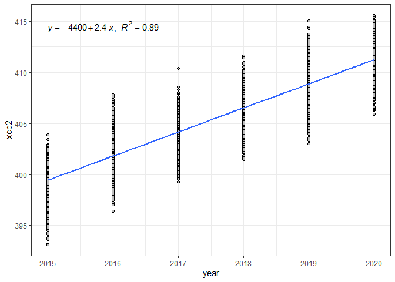<!-- -->

#### Análise de regressão linear para posterios retirada de tendência.

``` r
mod_trend_xco2 <- lm(xco2~year, 
          data= data_set |> 
            mutate(year = year - min(year)) |> 
            drop_na())
mod_trend_xco2
```

    ## 
    ## Call:
    ## lm(formula = xco2 ~ year, data = drop_na(mutate(data_set, year = year - 
    ##     min(year))))
    ## 
    ## Coefficients:
    ## (Intercept)         year  
    ##      399.43         2.37

#### Filtrando a base para os estados

``` r
# definindo os estados a serem analisados
estados <- c("MG","MT","MS","GO","PA","DF")

# fintrando a base apra esses estados
data_set_me <- data_set |>
  filter( 
    state %in% estados
  )
glimpse(data_set_me)
```

    ## Rows: 415,559
    ## Columns: 12
    ## $ longitude         <dbl> -50.28787, -50.34569, -50.35614, -50.35908, -50.3602…
    ## $ latitude          <dbl> -12.87398, -12.67460, -12.65862, -12.62923, -12.6399…
    ## $ time              <dbl> 1420131440, 1420131444, 1420131445, 1420131445, 1420…
    ## $ date              <date> 2015-01-01, 2015-01-01, 2015-01-01, 2015-01-01, 201…
    ## $ year              <dbl> 2015, 2015, 2015, 2015, 2015, 2015, 2015, 2015, 2015…
    ## $ month             <dbl> 1, 1, 1, 1, 1, 1, 1, 1, 1, 1, 1, 1, 1, 1, 1, 1, 1, 1…
    ## $ day               <int> 1, 1, 1, 1, 1, 1, 1, 1, 1, 1, 1, 1, 1, 1, 1, 1, 1, 1…
    ## $ xco2              <dbl> 396.6765, 396.2824, 394.5461, 396.7095, 397.1642, 39…
    ## $ xco2_quality_flag <int> 0, 0, 0, 0, 0, 0, 0, 0, 0, 0, 0, 0, 0, 0, 0, 0, 0, 0…
    ## $ xco2_incerteza    <dbl> 0.5534429, 0.5050880, 0.6011925, 0.5258151, 0.549804…
    ## $ path              <chr> "oco2_LtCO2_150101_B11100Ar_230524221540s.nc4", "oco…
    ## $ state             <chr> "GO", "GO", "GO", "GO", "GO", "GO", "GO", "MT", "MT"…

#### Histogramas para xCO<sub>2</sub>

``` r
data_set_me |>
  ggplot(aes(x=xco2)) +
  geom_histogram(color="black",fill="gray",
                 bins = 30) +
  facet_wrap(~year, scales = "free") +
  theme_bw()
```

<!-- -->

#### Ridges para os estados estudados

``` r
data_set_me |>
  mutate(
  fct_year = fct_rev(as.factor(year)),
  ) |>
  ggplot(aes(y=fct_year)) +
  geom_density_ridges(rel_min_height = 0.03,
                      aes(x=xco2, fill=state),
                      alpha = .6, color = "black"
  ) +
  scale_fill_viridis_d() +
  theme_ridges() +
  theme(
    legend.position = "top"
  ) +
  labs(fill="")
```

<!-- -->

#### Tabela de estatística descritiva para xCO<sub>2</sub>

``` r
#Estatística Descritiva
df <- data_set_me |>
  group_by(year,state) |>
  summarise(
    N = length(xco2),
    MIN = min(xco2),
    MEAN = mean(xco2),
    MEDIAN = median(xco2),
    MAX = max(xco2),
    VARIANCIA  = var(xco2),
    STD_DV = sd(xco2),
    CV = 100*STD_DV/MEAN,
    SKW = agricolae::skewness(xco2),
    KRT = agricolae::kurtosis(xco2),
  )
writexl::write_xlsx(df, "output/estat-desc-xco2.xlsx")
# DT::datatable(df)
```

### Análise Geoestatística

A definição dos grids a serem amostrados será realizada para todos os
estados. Caso o estado de GO seja utilizado, é importante que o estado
de DF seja incluso na lista

``` r
# vetores para coordenadas x e y selecionadas da base do IBGE1
x <- 0
y <- 0
for(i in seq_along(estados)){
  if( i == 1){
  x<-list_pol[[estados[i]]][,1]
  y<-list_pol[[estados[i]]][,2]
  }else{
    x <- c(x, list_pol[[estados[i]]][,1])
    y <- c(y, list_pol[[estados[i]]][,2])
  }
}
dis <- 0.05 # distância para o adensamento de pontos nos estados
grid_geral <- expand.grid(X=seq(min(x),max(x),dis), Y=seq(min(y),max(y),dis))

# # É necessário classificar cada ponto como pertencente ou não a um estado.
# x_g <- grid_geral$X
# y_g <- grid_geral$Y
# state_vct <- 0
# for(j in 1:nrow(grid_geral)){
#   state_vct[j] <- "Other"
#   for(i in 1:27){
#   lgv <- def_pol(x_g[j],y_g[j],list_pol[[i]])
#     if(lgv){
#       state_vct[j] <- names(list_pol[i])
#     }
#   }
# }
# grid_geral <- grid_geral |>
#   add_column(state_vct) |>
#   rename(state= state_vct)
# 
# grid_geral_state <- grid_geral |>
#     filter(state %in% estados)
# 
# grid_geral_state <- grid_geral_state |>
#   filter(!((state == "PA") &
#          (X > -54.76 & X < -54) & (Y > 2 & Y < 3)))
# 
# x_ge <- grid_geral_state$X
# y_ge <- grid_geral_state$Y
# state_ge <- grid_geral_state$state
# v_city <- 0
# for(i in 1:nrow(grid_geral_state)){
#   obj <- citys |>
#     filter(abbrev_state == state_ge[i])
#   name_muni <- citys |>
#     filter(abbrev_state == state_ge[i]) |>
#     pull(name_muni)
#   vlg <- FALSE
#   for(j in seq_along(name_muni)){
#     pol <- obj$geom |> pluck(j) |> as.matrix()
#     lgv <- def_pol(x_ge[i],y_ge[i],pol)
#     if(lgv) {
#       v_city[i] <- name_muni[j]
#       # print(paste0(v_city[i],"-",i," of 380,971"))
#       break
#     }
#   }
# }
# grid_geral_state_city <- grid_geral_state |>
#   add_column(
#     city = v_city
#   )
# 
# # Encontrando os pontos mais próximos para os refugos
# refugos <- grid_geral_state_city |>
#   filter(is.na(city),state!="PA")
# 
# x_ge_nref <- grid_geral_state_city |> filter(!is.na(city)) |>
#   pull(X)
# y_ge_nref <- grid_geral_state_city |> filter(!is.na(city)) |>
#   pull(Y)
# s_ge_nref <- grid_geral_state_city |> filter(!is.na(city)) |>
#   pull(state)
# c_ge_nref <- grid_geral_state_city |> filter(!is.na(city)) |>
#   pull(city)
# 
# x_ref <- refugos |> pull(X)
# y_ref <- refugos |> pull(Y)
# state_ref <- refugos |> pull(state)
# city_ref <- 0
# for(i in 1:nrow(refugos)){
#   dist_vec = sqrt((x_ref[i]-x_ge_nref)^2+(y_ref[i]-y_ge_nref)^2)
#   i_min <- which(dist_vec == min(dist_vec))[1]
#   s_ge_nref[i_min]
#   city_ref[i] <- c_ge_nref[i_min]
# }
# refugos$city <- city_ref
# 
# grid_geral_state_city <- grid_geral_state_city |>
#   filter(!is.na(city)) |>
#   rbind(refugos)
# write_rds(grid_geral_state_city,"data/grid-state-city.rds")

grid_geral <- read_rds("data/grid-state-city.rds")
citys |> 
  filter(abbrev_state %in% estados) |> 
   ggplot() +
     geom_sf(aes_string(), color="black",
              size=.05, show.legend = TRUE) +
  theme_minimal() +
  geom_point(
    data = grid_geral |> 
  sample_n(1000),
  aes(X,Y),
  color = "red"
  )
```

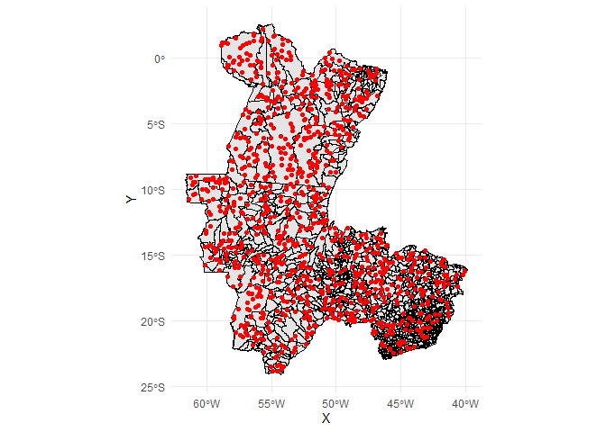<!-- -->

#### Análise Geoestatística de xCO<sub>2</sub>

##### PASSO 1

``` r
my_year = 2020
my_state = estados
grid <- grid_geral |> 
  mutate(
    state = ifelse(state == "DF","GO",state)
      ) |> 
  filter(state %in% my_state) |> 
  select(X, Y)
sp::gridded(grid) = ~ X + Y
# plot(grid$X,grid$Y,col="red",pch=4)
```

### Agregação dos dados

``` r
dist_agg <- .15 #Distância entre pontos
# grid_agg <- expand.grid(
#   X=seq(min(x),max(x),dist_agg), 
#   Y=seq(min(y),max(y),dist_agg)) |>
#   mutate(
#     flag_my_state = my_state,
#     flag_st = def_pol(X, Y, list_pol[[my_state]]),
#     flag_df = def_pol(X, Y, list_pol[["DF"]]),
#     flag = ifelse(flag_my_state == "GO", (flag_st|flag_df),flag_st)
#   ) |>  filter(flag) |>
#   dplyr::select(-starts_with("flag"))

grid_agg_new <- expand.grid(
  X=seq(min(x),max(x),dist_agg), 
  Y=seq(min(y),max(y),dist_agg))

X_grid_agg_new <- grid_agg_new$X
Y_grid_agg_new <- grid_agg_new$Y
vec_state <- 0
for(i in 1:nrow(grid_agg_new)){
  vec_state[i] <- "Other"
  for(j in seq_along(my_state)){
    lg_v <- def_pol(X_grid_agg_new[i], 
                    Y_grid_agg_new[i], 
                    list_pol[[my_state[j]]])
    if(lg_v) vec_state[i] <- my_state[j]
  }  
}

grid_agg <- grid_agg_new |> 
  add_column(state = vec_state) |> 
  filter(state != "Other")
```

``` r
# Isolando o banco de dados, pelo ano
data_set_aux  <- data_set_me |>
  filter(
    year == my_year,
    state %in% my_state) |>
  dplyr::select(longitude, latitude, xco2)
```

``` r
vct_xco2 <- vector();dist_xco2 <- vector();
lon_grid <- vector();lat_grid <- vector();
for(i in 1:nrow(data_set_aux)){
  d <- sqrt((data_set_aux$longitude[i] - grid_agg$X)^2 + 
              (data_set_aux$lat[i] - grid_agg$Y)^2
  )
  min_index <- order(d)[1]
  vct_xco2[i] <- data_set_aux$xco2[min_index]
  dist_xco2[i] <- d[order(d)[1]]
  lon_grid[i] <- grid_agg$X[min_index]
  lat_grid[i] <- grid_agg$Y[min_index]
}
data_set_aux$dist_xco2 <- dist_xco2
data_set_aux$xco2_new <- vct_xco2
data_set_aux$lon_grid <- lon_grid
data_set_aux$lat_grid <- lat_grid
data_set_aux |> 
  group_by(lon_grid,lat_grid) |> 
  summarise(
    xco2 = mean(xco2)
  ) |> 
  rename(longitude = lon_grid, latitude = lat_grid) -> data_set_aux

data_set_aux |>
  ggplot(aes(longitude,latitude)) +
  geom_point() +
  geom_point(data=grid_agg, aes(X,Y))
```

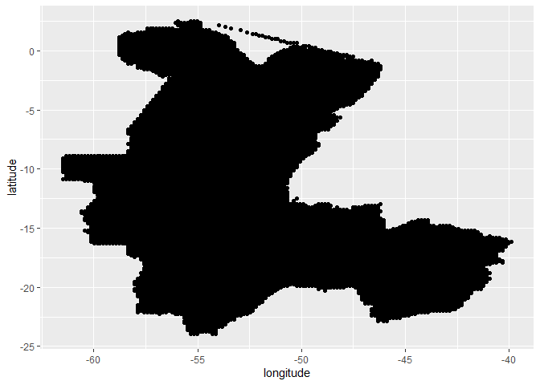<!-- -->

##### PASSO 2 - Construção do Semivariograma Experimental

``` r
# Alteração no df
sp::coordinates(data_set_aux) = ~ longitude + latitude

# Fórmule é a variável que modelar, e o 1 da fórmula indica que ela
# não sofre transformação
form <- xco2 ~ 1
```

``` r
# Criando o Semivariograma Experimental.
vari_exp <- gstat::variogram(form, data = data_set_aux,
                      cressie = FALSE,
                      cutoff = 12, # distância máxima do semivariograma
                      width = .25) # distancia entre pontos
vari_exp  |>
  ggplot(aes(x=dist, y=gamma)) +
  geom_point() +
  labs(x="lag (º)",
       y=expression(paste(gamma,"(h)")))
```

<!-- -->

##### Passo 3 - Ajuste dos modelos

``` r
patamar=2.0
alcance=1
epepita=.5
modelo_1 <- gstat::fit.variogram(vari_exp,gstat::vgm(patamar,"Sph",alcance,epepita))
modelo_2 <- gstat::fit.variogram(vari_exp,gstat::vgm(patamar,"Exp",alcance,epepita))
modelo_3 <- gstat::fit.variogram(vari_exp,gstat::vgm(patamar,"Gau",alcance,epepita))
sqr.f1<-round(attr(modelo_1, "SSErr"),4); c01<-round(modelo_1$psill[[1]],4); c0_c11<-round(sum(modelo_1$psill),4);a1<-round(modelo_1$range[[2]],2)
sqr.f2<-round(attr(modelo_2, "SSErr"),4); c02<-round(modelo_2$psill[[1]],4); c0_c12<-round(sum(modelo_2$psill),4);a2<-round(3*modelo_2$range[[2]],2)
sqr.f3<-round(attr(modelo_3, "SSErr"),4); c03<-round(modelo_3$psill[[1]],4); c0_c13<-round(sum(modelo_3$psill),4);a3<-round(modelo_3$range[[2]]*(3^.5),2)

df_aux <- vari_exp |>
  mutate(
    gamma_m1 = ifelse(dist <= a1, c01 + (c0_c11-c01)*(3/2*(dist/a1)-1/2*(dist/a1)^3),c0_c11),
    gamma_m2 = c02 + (c0_c12-c02)*(1-exp(-3*(dist/a2))),
    gamma_m3 = c03 + (c0_c13-c03)*(1-exp(-3*(dist/a3)^2)),
    residuo_total = (gamma-mean(gamma))^2,
    residuo_mod_1 = (gamma - gamma_m1)^2,
    residuo_mod_2 = (gamma - gamma_m2)^2,
    residuo_mod_3 = (gamma - gamma_m3)^2
  ) |>
  summarise(
    r2_1=(sum(residuo_total) - sum(residuo_mod_1))/sum(residuo_total),
    r2_2=(sum(residuo_total) - sum(residuo_mod_2))/sum(residuo_total),
    r2_3=(sum(residuo_total) - sum(residuo_mod_3))/sum(residuo_total),
  )
r21<-as.vector(round(df_aux[1],4))
r22<-as.vector(round(df_aux[2],4))
r23<-as.vector(round(df_aux[3],4))

plot(vari_exp,
     model=modelo_1,
     col=1,pl=F,
     pch=16,
     cex=1.2,cex.main=7,
     ylab=list("Semivariância",cex=1.3),
     xlab=list("Distância de Separação h (m)",cex=1.3),
     main =paste("Esf(C0= ",c01,"; C0+C1= ",
                 c0_c11, "; a= ", a1,"; r2 = ",
                 r21,")",sep=""))
```

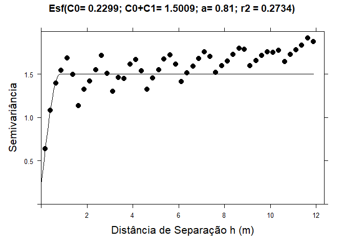<!-- -->

``` r
plot(vari_exp,model=modelo_2, col=1,pl=F,pch=16,cex=1.2,cex.main=7,ylab=list("Semivariância",cex=1.3),xlab=list("Distância de Separação h (m)",cex=1.3),main =paste("Exp(C0= ",c02,"; C0+C1= ", c0_c12, "; a= ", a2,"; r2 = ", r22,")",sep=""))
```

<!-- -->

``` r
plot(vari_exp,model=modelo_3, col=1,pl=F,pch=16,cex=1.2,cex.main=7,ylab=list("Semivariância",cex=1.3),xlab=list("Distância de Separação h (m)",cex=1.3),main =paste("Gau(C0= ",c03,"; C0+C1= ", c0_c13, "; a= ", a3,"; r2 = ", r23,")",sep=""))
```

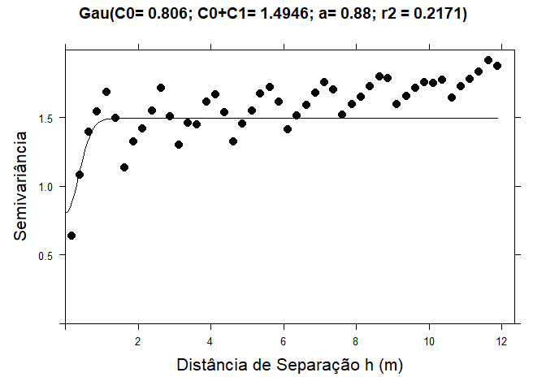<!-- -->

##### Passo 4 - escolha do melhor modelo

``` r
# LOOCV - Leave one out cross validation
conjunto_validacao <- data_set_aux |>
  as_tibble() |>
  sample_n(250)
sp::coordinates(conjunto_validacao) = ~longitude + latitude
modelos<-list(modelo_1,modelo_2,modelo_3)
for(j in 1:3){
  est<-0
  for(i in 1:nrow(conjunto_validacao)){
    valid <- gstat::krige(formula=form, conjunto_validacao[-i,], conjunto_validacao, model=modelos[[j]])
    est[i]<-valid$var1.pred[i]
  }
  obs<-as.data.frame(conjunto_validacao)[,3]
  RMSE<-round((sum((obs-est)^2)/length(obs))^.5,3)
  mod<-lm(obs~est)
  b<-round(mod$coefficients[2],3)
  se<-round(summary(mod)$coefficients[4],3)
  r2<-round(summary(mod)$r.squared,3)
  a<-round(mod$coefficients[1],3)
  plot(est,obs,xlab="Estimado", ylab="Observado",pch=j,col="blue",
       main=paste("Modelo = ",modelos[[j]][2,1],"; Coef. Reg. = ", b, " (SE = ",se, ", r2 = ", r2,")\ny intersept = ",a,"RMSE = ",RMSE ))
  abline(lm(obs~est));
  abline(0,1,lty=3)
}
```

    ## [using ordinary kriging]
    ## [using ordinary kriging]
    ## [using ordinary kriging]
    ## [using ordinary kriging]
    ## [using ordinary kriging]
    ## [using ordinary kriging]
    ## [using ordinary kriging]
    ## [using ordinary kriging]
    ## [using ordinary kriging]
    ## [using ordinary kriging]
    ## [using ordinary kriging]
    ## [using ordinary kriging]
    ## [using ordinary kriging]
    ## [using ordinary kriging]
    ## [using ordinary kriging]
    ## [using ordinary kriging]
    ## [using ordinary kriging]
    ## [using ordinary kriging]
    ## [using ordinary kriging]
    ## [using ordinary kriging]
    ## [using ordinary kriging]
    ## [using ordinary kriging]
    ## [using ordinary kriging]
    ## [using ordinary kriging]
    ## [using ordinary kriging]
    ## [using ordinary kriging]
    ## [using ordinary kriging]
    ## [using ordinary kriging]
    ## [using ordinary kriging]
    ## [using ordinary kriging]
    ## [using ordinary kriging]
    ## [using ordinary kriging]
    ## [using ordinary kriging]
    ## [using ordinary kriging]
    ## [using ordinary kriging]
    ## [using ordinary kriging]
    ## [using ordinary kriging]
    ## [using ordinary kriging]
    ## [using ordinary kriging]
    ## [using ordinary kriging]
    ## [using ordinary kriging]
    ## [using ordinary kriging]
    ## [using ordinary kriging]
    ## [using ordinary kriging]
    ## [using ordinary kriging]
    ## [using ordinary kriging]
    ## [using ordinary kriging]
    ## [using ordinary kriging]
    ## [using ordinary kriging]
    ## [using ordinary kriging]
    ## [using ordinary kriging]
    ## [using ordinary kriging]
    ## [using ordinary kriging]
    ## [using ordinary kriging]
    ## [using ordinary kriging]
    ## [using ordinary kriging]
    ## [using ordinary kriging]
    ## [using ordinary kriging]
    ## [using ordinary kriging]
    ## [using ordinary kriging]
    ## [using ordinary kriging]
    ## [using ordinary kriging]
    ## [using ordinary kriging]
    ## [using ordinary kriging]
    ## [using ordinary kriging]
    ## [using ordinary kriging]
    ## [using ordinary kriging]
    ## [using ordinary kriging]
    ## [using ordinary kriging]
    ## [using ordinary kriging]
    ## [using ordinary kriging]
    ## [using ordinary kriging]
    ## [using ordinary kriging]
    ## [using ordinary kriging]
    ## [using ordinary kriging]
    ## [using ordinary kriging]
    ## [using ordinary kriging]
    ## [using ordinary kriging]
    ## [using ordinary kriging]
    ## [using ordinary kriging]
    ## [using ordinary kriging]
    ## [using ordinary kriging]
    ## [using ordinary kriging]
    ## [using ordinary kriging]
    ## [using ordinary kriging]
    ## [using ordinary kriging]
    ## [using ordinary kriging]
    ## [using ordinary kriging]
    ## [using ordinary kriging]
    ## [using ordinary kriging]
    ## [using ordinary kriging]
    ## [using ordinary kriging]
    ## [using ordinary kriging]
    ## [using ordinary kriging]
    ## [using ordinary kriging]
    ## [using ordinary kriging]
    ## [using ordinary kriging]
    ## [using ordinary kriging]
    ## [using ordinary kriging]
    ## [using ordinary kriging]
    ## [using ordinary kriging]
    ## [using ordinary kriging]
    ## [using ordinary kriging]
    ## [using ordinary kriging]
    ## [using ordinary kriging]
    ## [using ordinary kriging]
    ## [using ordinary kriging]
    ## [using ordinary kriging]
    ## [using ordinary kriging]
    ## [using ordinary kriging]
    ## [using ordinary kriging]
    ## [using ordinary kriging]
    ## [using ordinary kriging]
    ## [using ordinary kriging]
    ## [using ordinary kriging]
    ## [using ordinary kriging]
    ## [using ordinary kriging]
    ## [using ordinary kriging]
    ## [using ordinary kriging]
    ## [using ordinary kriging]
    ## [using ordinary kriging]
    ## [using ordinary kriging]
    ## [using ordinary kriging]
    ## [using ordinary kriging]
    ## [using ordinary kriging]
    ## [using ordinary kriging]
    ## [using ordinary kriging]
    ## [using ordinary kriging]
    ## [using ordinary kriging]
    ## [using ordinary kriging]
    ## [using ordinary kriging]
    ## [using ordinary kriging]
    ## [using ordinary kriging]
    ## [using ordinary kriging]
    ## [using ordinary kriging]
    ## [using ordinary kriging]
    ## [using ordinary kriging]
    ## [using ordinary kriging]
    ## [using ordinary kriging]
    ## [using ordinary kriging]
    ## [using ordinary kriging]
    ## [using ordinary kriging]
    ## [using ordinary kriging]
    ## [using ordinary kriging]
    ## [using ordinary kriging]
    ## [using ordinary kriging]
    ## [using ordinary kriging]
    ## [using ordinary kriging]
    ## [using ordinary kriging]
    ## [using ordinary kriging]
    ## [using ordinary kriging]
    ## [using ordinary kriging]
    ## [using ordinary kriging]
    ## [using ordinary kriging]
    ## [using ordinary kriging]
    ## [using ordinary kriging]
    ## [using ordinary kriging]
    ## [using ordinary kriging]
    ## [using ordinary kriging]
    ## [using ordinary kriging]
    ## [using ordinary kriging]
    ## [using ordinary kriging]
    ## [using ordinary kriging]
    ## [using ordinary kriging]
    ## [using ordinary kriging]
    ## [using ordinary kriging]
    ## [using ordinary kriging]
    ## [using ordinary kriging]
    ## [using ordinary kriging]
    ## [using ordinary kriging]
    ## [using ordinary kriging]
    ## [using ordinary kriging]
    ## [using ordinary kriging]
    ## [using ordinary kriging]
    ## [using ordinary kriging]
    ## [using ordinary kriging]
    ## [using ordinary kriging]
    ## [using ordinary kriging]
    ## [using ordinary kriging]
    ## [using ordinary kriging]
    ## [using ordinary kriging]
    ## [using ordinary kriging]
    ## [using ordinary kriging]
    ## [using ordinary kriging]
    ## [using ordinary kriging]
    ## [using ordinary kriging]
    ## [using ordinary kriging]
    ## [using ordinary kriging]
    ## [using ordinary kriging]
    ## [using ordinary kriging]
    ## [using ordinary kriging]
    ## [using ordinary kriging]
    ## [using ordinary kriging]
    ## [using ordinary kriging]
    ## [using ordinary kriging]
    ## [using ordinary kriging]
    ## [using ordinary kriging]
    ## [using ordinary kriging]
    ## [using ordinary kriging]
    ## [using ordinary kriging]
    ## [using ordinary kriging]
    ## [using ordinary kriging]
    ## [using ordinary kriging]
    ## [using ordinary kriging]
    ## [using ordinary kriging]
    ## [using ordinary kriging]
    ## [using ordinary kriging]
    ## [using ordinary kriging]
    ## [using ordinary kriging]
    ## [using ordinary kriging]
    ## [using ordinary kriging]
    ## [using ordinary kriging]
    ## [using ordinary kriging]
    ## [using ordinary kriging]
    ## [using ordinary kriging]
    ## [using ordinary kriging]
    ## [using ordinary kriging]
    ## [using ordinary kriging]
    ## [using ordinary kriging]
    ## [using ordinary kriging]
    ## [using ordinary kriging]
    ## [using ordinary kriging]
    ## [using ordinary kriging]
    ## [using ordinary kriging]
    ## [using ordinary kriging]
    ## [using ordinary kriging]
    ## [using ordinary kriging]
    ## [using ordinary kriging]
    ## [using ordinary kriging]
    ## [using ordinary kriging]
    ## [using ordinary kriging]
    ## [using ordinary kriging]
    ## [using ordinary kriging]
    ## [using ordinary kriging]
    ## [using ordinary kriging]
    ## [using ordinary kriging]
    ## [using ordinary kriging]
    ## [using ordinary kriging]
    ## [using ordinary kriging]
    ## [using ordinary kriging]
    ## [using ordinary kriging]
    ## [using ordinary kriging]
    ## [using ordinary kriging]
    ## [using ordinary kriging]
    ## [using ordinary kriging]
    ## [using ordinary kriging]
    ## [using ordinary kriging]
    ## [using ordinary kriging]
    ## [using ordinary kriging]
    ## [using ordinary kriging]

<!-- -->

    ## [using ordinary kriging]
    ## [using ordinary kriging]
    ## [using ordinary kriging]
    ## [using ordinary kriging]
    ## [using ordinary kriging]
    ## [using ordinary kriging]
    ## [using ordinary kriging]
    ## [using ordinary kriging]
    ## [using ordinary kriging]
    ## [using ordinary kriging]
    ## [using ordinary kriging]
    ## [using ordinary kriging]
    ## [using ordinary kriging]
    ## [using ordinary kriging]
    ## [using ordinary kriging]
    ## [using ordinary kriging]
    ## [using ordinary kriging]
    ## [using ordinary kriging]
    ## [using ordinary kriging]
    ## [using ordinary kriging]
    ## [using ordinary kriging]
    ## [using ordinary kriging]
    ## [using ordinary kriging]
    ## [using ordinary kriging]
    ## [using ordinary kriging]
    ## [using ordinary kriging]
    ## [using ordinary kriging]
    ## [using ordinary kriging]
    ## [using ordinary kriging]
    ## [using ordinary kriging]
    ## [using ordinary kriging]
    ## [using ordinary kriging]
    ## [using ordinary kriging]
    ## [using ordinary kriging]
    ## [using ordinary kriging]
    ## [using ordinary kriging]
    ## [using ordinary kriging]
    ## [using ordinary kriging]
    ## [using ordinary kriging]
    ## [using ordinary kriging]
    ## [using ordinary kriging]
    ## [using ordinary kriging]
    ## [using ordinary kriging]
    ## [using ordinary kriging]
    ## [using ordinary kriging]
    ## [using ordinary kriging]
    ## [using ordinary kriging]
    ## [using ordinary kriging]
    ## [using ordinary kriging]
    ## [using ordinary kriging]
    ## [using ordinary kriging]
    ## [using ordinary kriging]
    ## [using ordinary kriging]
    ## [using ordinary kriging]
    ## [using ordinary kriging]
    ## [using ordinary kriging]
    ## [using ordinary kriging]
    ## [using ordinary kriging]
    ## [using ordinary kriging]
    ## [using ordinary kriging]
    ## [using ordinary kriging]
    ## [using ordinary kriging]
    ## [using ordinary kriging]
    ## [using ordinary kriging]
    ## [using ordinary kriging]
    ## [using ordinary kriging]
    ## [using ordinary kriging]
    ## [using ordinary kriging]
    ## [using ordinary kriging]
    ## [using ordinary kriging]
    ## [using ordinary kriging]
    ## [using ordinary kriging]
    ## [using ordinary kriging]
    ## [using ordinary kriging]
    ## [using ordinary kriging]
    ## [using ordinary kriging]
    ## [using ordinary kriging]
    ## [using ordinary kriging]
    ## [using ordinary kriging]
    ## [using ordinary kriging]
    ## [using ordinary kriging]
    ## [using ordinary kriging]
    ## [using ordinary kriging]
    ## [using ordinary kriging]
    ## [using ordinary kriging]
    ## [using ordinary kriging]
    ## [using ordinary kriging]
    ## [using ordinary kriging]
    ## [using ordinary kriging]
    ## [using ordinary kriging]
    ## [using ordinary kriging]
    ## [using ordinary kriging]
    ## [using ordinary kriging]
    ## [using ordinary kriging]
    ## [using ordinary kriging]
    ## [using ordinary kriging]
    ## [using ordinary kriging]
    ## [using ordinary kriging]
    ## [using ordinary kriging]
    ## [using ordinary kriging]
    ## [using ordinary kriging]
    ## [using ordinary kriging]
    ## [using ordinary kriging]
    ## [using ordinary kriging]
    ## [using ordinary kriging]
    ## [using ordinary kriging]
    ## [using ordinary kriging]
    ## [using ordinary kriging]
    ## [using ordinary kriging]
    ## [using ordinary kriging]
    ## [using ordinary kriging]
    ## [using ordinary kriging]
    ## [using ordinary kriging]
    ## [using ordinary kriging]
    ## [using ordinary kriging]
    ## [using ordinary kriging]
    ## [using ordinary kriging]
    ## [using ordinary kriging]
    ## [using ordinary kriging]
    ## [using ordinary kriging]
    ## [using ordinary kriging]
    ## [using ordinary kriging]
    ## [using ordinary kriging]
    ## [using ordinary kriging]
    ## [using ordinary kriging]
    ## [using ordinary kriging]
    ## [using ordinary kriging]
    ## [using ordinary kriging]
    ## [using ordinary kriging]
    ## [using ordinary kriging]
    ## [using ordinary kriging]
    ## [using ordinary kriging]
    ## [using ordinary kriging]
    ## [using ordinary kriging]
    ## [using ordinary kriging]
    ## [using ordinary kriging]
    ## [using ordinary kriging]
    ## [using ordinary kriging]
    ## [using ordinary kriging]
    ## [using ordinary kriging]
    ## [using ordinary kriging]
    ## [using ordinary kriging]
    ## [using ordinary kriging]
    ## [using ordinary kriging]
    ## [using ordinary kriging]
    ## [using ordinary kriging]
    ## [using ordinary kriging]
    ## [using ordinary kriging]
    ## [using ordinary kriging]
    ## [using ordinary kriging]
    ## [using ordinary kriging]
    ## [using ordinary kriging]
    ## [using ordinary kriging]
    ## [using ordinary kriging]
    ## [using ordinary kriging]
    ## [using ordinary kriging]
    ## [using ordinary kriging]
    ## [using ordinary kriging]
    ## [using ordinary kriging]
    ## [using ordinary kriging]
    ## [using ordinary kriging]
    ## [using ordinary kriging]
    ## [using ordinary kriging]
    ## [using ordinary kriging]
    ## [using ordinary kriging]
    ## [using ordinary kriging]
    ## [using ordinary kriging]
    ## [using ordinary kriging]
    ## [using ordinary kriging]
    ## [using ordinary kriging]
    ## [using ordinary kriging]
    ## [using ordinary kriging]
    ## [using ordinary kriging]
    ## [using ordinary kriging]
    ## [using ordinary kriging]
    ## [using ordinary kriging]
    ## [using ordinary kriging]
    ## [using ordinary kriging]
    ## [using ordinary kriging]
    ## [using ordinary kriging]
    ## [using ordinary kriging]
    ## [using ordinary kriging]
    ## [using ordinary kriging]
    ## [using ordinary kriging]
    ## [using ordinary kriging]
    ## [using ordinary kriging]
    ## [using ordinary kriging]
    ## [using ordinary kriging]
    ## [using ordinary kriging]
    ## [using ordinary kriging]
    ## [using ordinary kriging]
    ## [using ordinary kriging]
    ## [using ordinary kriging]
    ## [using ordinary kriging]
    ## [using ordinary kriging]
    ## [using ordinary kriging]
    ## [using ordinary kriging]
    ## [using ordinary kriging]
    ## [using ordinary kriging]
    ## [using ordinary kriging]
    ## [using ordinary kriging]
    ## [using ordinary kriging]
    ## [using ordinary kriging]
    ## [using ordinary kriging]
    ## [using ordinary kriging]
    ## [using ordinary kriging]
    ## [using ordinary kriging]
    ## [using ordinary kriging]
    ## [using ordinary kriging]
    ## [using ordinary kriging]
    ## [using ordinary kriging]
    ## [using ordinary kriging]
    ## [using ordinary kriging]
    ## [using ordinary kriging]
    ## [using ordinary kriging]
    ## [using ordinary kriging]
    ## [using ordinary kriging]
    ## [using ordinary kriging]
    ## [using ordinary kriging]
    ## [using ordinary kriging]
    ## [using ordinary kriging]
    ## [using ordinary kriging]
    ## [using ordinary kriging]
    ## [using ordinary kriging]
    ## [using ordinary kriging]
    ## [using ordinary kriging]
    ## [using ordinary kriging]
    ## [using ordinary kriging]
    ## [using ordinary kriging]
    ## [using ordinary kriging]
    ## [using ordinary kriging]
    ## [using ordinary kriging]
    ## [using ordinary kriging]
    ## [using ordinary kriging]
    ## [using ordinary kriging]
    ## [using ordinary kriging]
    ## [using ordinary kriging]
    ## [using ordinary kriging]
    ## [using ordinary kriging]
    ## [using ordinary kriging]
    ## [using ordinary kriging]
    ## [using ordinary kriging]
    ## [using ordinary kriging]
    ## [using ordinary kriging]
    ## [using ordinary kriging]
    ## [using ordinary kriging]
    ## [using ordinary kriging]
    ## [using ordinary kriging]
    ## [using ordinary kriging]
    ## [using ordinary kriging]

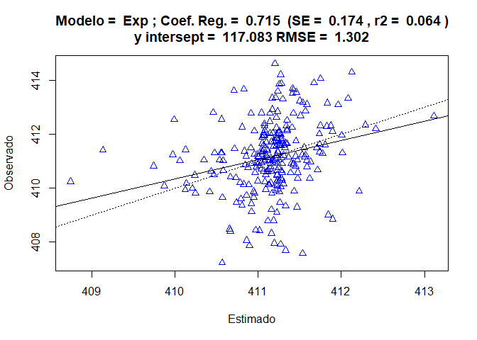<!-- -->

    ## [using ordinary kriging]
    ## [using ordinary kriging]
    ## [using ordinary kriging]
    ## [using ordinary kriging]
    ## [using ordinary kriging]
    ## [using ordinary kriging]
    ## [using ordinary kriging]
    ## [using ordinary kriging]
    ## [using ordinary kriging]
    ## [using ordinary kriging]
    ## [using ordinary kriging]
    ## [using ordinary kriging]
    ## [using ordinary kriging]
    ## [using ordinary kriging]
    ## [using ordinary kriging]
    ## [using ordinary kriging]
    ## [using ordinary kriging]
    ## [using ordinary kriging]
    ## [using ordinary kriging]
    ## [using ordinary kriging]
    ## [using ordinary kriging]
    ## [using ordinary kriging]
    ## [using ordinary kriging]
    ## [using ordinary kriging]
    ## [using ordinary kriging]
    ## [using ordinary kriging]
    ## [using ordinary kriging]
    ## [using ordinary kriging]
    ## [using ordinary kriging]
    ## [using ordinary kriging]
    ## [using ordinary kriging]
    ## [using ordinary kriging]
    ## [using ordinary kriging]
    ## [using ordinary kriging]
    ## [using ordinary kriging]
    ## [using ordinary kriging]
    ## [using ordinary kriging]
    ## [using ordinary kriging]
    ## [using ordinary kriging]
    ## [using ordinary kriging]
    ## [using ordinary kriging]
    ## [using ordinary kriging]
    ## [using ordinary kriging]
    ## [using ordinary kriging]
    ## [using ordinary kriging]
    ## [using ordinary kriging]
    ## [using ordinary kriging]
    ## [using ordinary kriging]
    ## [using ordinary kriging]
    ## [using ordinary kriging]
    ## [using ordinary kriging]
    ## [using ordinary kriging]
    ## [using ordinary kriging]
    ## [using ordinary kriging]
    ## [using ordinary kriging]
    ## [using ordinary kriging]
    ## [using ordinary kriging]
    ## [using ordinary kriging]
    ## [using ordinary kriging]
    ## [using ordinary kriging]
    ## [using ordinary kriging]
    ## [using ordinary kriging]
    ## [using ordinary kriging]
    ## [using ordinary kriging]
    ## [using ordinary kriging]
    ## [using ordinary kriging]
    ## [using ordinary kriging]
    ## [using ordinary kriging]
    ## [using ordinary kriging]
    ## [using ordinary kriging]
    ## [using ordinary kriging]
    ## [using ordinary kriging]
    ## [using ordinary kriging]
    ## [using ordinary kriging]
    ## [using ordinary kriging]
    ## [using ordinary kriging]
    ## [using ordinary kriging]
    ## [using ordinary kriging]
    ## [using ordinary kriging]
    ## [using ordinary kriging]
    ## [using ordinary kriging]
    ## [using ordinary kriging]
    ## [using ordinary kriging]
    ## [using ordinary kriging]
    ## [using ordinary kriging]
    ## [using ordinary kriging]
    ## [using ordinary kriging]
    ## [using ordinary kriging]
    ## [using ordinary kriging]
    ## [using ordinary kriging]
    ## [using ordinary kriging]
    ## [using ordinary kriging]
    ## [using ordinary kriging]
    ## [using ordinary kriging]
    ## [using ordinary kriging]
    ## [using ordinary kriging]
    ## [using ordinary kriging]
    ## [using ordinary kriging]
    ## [using ordinary kriging]
    ## [using ordinary kriging]
    ## [using ordinary kriging]
    ## [using ordinary kriging]
    ## [using ordinary kriging]
    ## [using ordinary kriging]
    ## [using ordinary kriging]
    ## [using ordinary kriging]
    ## [using ordinary kriging]
    ## [using ordinary kriging]
    ## [using ordinary kriging]
    ## [using ordinary kriging]
    ## [using ordinary kriging]
    ## [using ordinary kriging]
    ## [using ordinary kriging]
    ## [using ordinary kriging]
    ## [using ordinary kriging]
    ## [using ordinary kriging]
    ## [using ordinary kriging]
    ## [using ordinary kriging]
    ## [using ordinary kriging]
    ## [using ordinary kriging]
    ## [using ordinary kriging]
    ## [using ordinary kriging]
    ## [using ordinary kriging]
    ## [using ordinary kriging]
    ## [using ordinary kriging]
    ## [using ordinary kriging]
    ## [using ordinary kriging]
    ## [using ordinary kriging]
    ## [using ordinary kriging]
    ## [using ordinary kriging]
    ## [using ordinary kriging]
    ## [using ordinary kriging]
    ## [using ordinary kriging]
    ## [using ordinary kriging]
    ## [using ordinary kriging]
    ## [using ordinary kriging]
    ## [using ordinary kriging]
    ## [using ordinary kriging]
    ## [using ordinary kriging]
    ## [using ordinary kriging]
    ## [using ordinary kriging]
    ## [using ordinary kriging]
    ## [using ordinary kriging]
    ## [using ordinary kriging]
    ## [using ordinary kriging]
    ## [using ordinary kriging]
    ## [using ordinary kriging]
    ## [using ordinary kriging]
    ## [using ordinary kriging]
    ## [using ordinary kriging]
    ## [using ordinary kriging]
    ## [using ordinary kriging]
    ## [using ordinary kriging]
    ## [using ordinary kriging]
    ## [using ordinary kriging]
    ## [using ordinary kriging]
    ## [using ordinary kriging]
    ## [using ordinary kriging]
    ## [using ordinary kriging]
    ## [using ordinary kriging]
    ## [using ordinary kriging]
    ## [using ordinary kriging]
    ## [using ordinary kriging]
    ## [using ordinary kriging]
    ## [using ordinary kriging]
    ## [using ordinary kriging]
    ## [using ordinary kriging]
    ## [using ordinary kriging]
    ## [using ordinary kriging]
    ## [using ordinary kriging]
    ## [using ordinary kriging]
    ## [using ordinary kriging]
    ## [using ordinary kriging]
    ## [using ordinary kriging]
    ## [using ordinary kriging]
    ## [using ordinary kriging]
    ## [using ordinary kriging]
    ## [using ordinary kriging]
    ## [using ordinary kriging]
    ## [using ordinary kriging]
    ## [using ordinary kriging]
    ## [using ordinary kriging]
    ## [using ordinary kriging]
    ## [using ordinary kriging]
    ## [using ordinary kriging]
    ## [using ordinary kriging]
    ## [using ordinary kriging]
    ## [using ordinary kriging]
    ## [using ordinary kriging]
    ## [using ordinary kriging]
    ## [using ordinary kriging]
    ## [using ordinary kriging]
    ## [using ordinary kriging]
    ## [using ordinary kriging]
    ## [using ordinary kriging]
    ## [using ordinary kriging]
    ## [using ordinary kriging]
    ## [using ordinary kriging]
    ## [using ordinary kriging]
    ## [using ordinary kriging]
    ## [using ordinary kriging]
    ## [using ordinary kriging]
    ## [using ordinary kriging]
    ## [using ordinary kriging]
    ## [using ordinary kriging]
    ## [using ordinary kriging]
    ## [using ordinary kriging]
    ## [using ordinary kriging]
    ## [using ordinary kriging]
    ## [using ordinary kriging]
    ## [using ordinary kriging]
    ## [using ordinary kriging]
    ## [using ordinary kriging]
    ## [using ordinary kriging]
    ## [using ordinary kriging]
    ## [using ordinary kriging]
    ## [using ordinary kriging]
    ## [using ordinary kriging]
    ## [using ordinary kriging]
    ## [using ordinary kriging]
    ## [using ordinary kriging]
    ## [using ordinary kriging]
    ## [using ordinary kriging]
    ## [using ordinary kriging]
    ## [using ordinary kriging]
    ## [using ordinary kriging]
    ## [using ordinary kriging]
    ## [using ordinary kriging]
    ## [using ordinary kriging]
    ## [using ordinary kriging]
    ## [using ordinary kriging]
    ## [using ordinary kriging]
    ## [using ordinary kriging]
    ## [using ordinary kriging]
    ## [using ordinary kriging]
    ## [using ordinary kriging]
    ## [using ordinary kriging]
    ## [using ordinary kriging]
    ## [using ordinary kriging]
    ## [using ordinary kriging]
    ## [using ordinary kriging]
    ## [using ordinary kriging]
    ## [using ordinary kriging]
    ## [using ordinary kriging]
    ## [using ordinary kriging]
    ## [using ordinary kriging]
    ## [using ordinary kriging]
    ## [using ordinary kriging]
    ## [using ordinary kriging]
    ## [using ordinary kriging]

<!-- -->

##### Passo 5 - Selecionado o melhor modelo, vamos guardá-lo

``` r
modelo <- modelo_1 ## sempre modificar
# Salvando os parâmetros dos melhores modelo
model <- modelo |> slice(2) |> pull(model)
rss <- round(attr(modelo, "SSErr"),4) 
c0 <- round(modelo$psill[[1]],4) 
c0_c1 <- round(sum(modelo$psill),4)
a <- ifelse(model == "Gau", round(modelo$range[[2]]*(3^.5),2),
            ifelse(model == "Exp",round(3*modelo$range[[2]],2),
            round(modelo$range[[2]],2)))
r2 <- ifelse(model == "Gau", r23,
            ifelse(model == "Exp",r22,
            r21)) |> pluck(1)
tibble(
  my_state, my_year, model, c0, c0_c1, a, rss, r2
) |> mutate(gde = c0/c0_c1, .after = "a") |>
  rename(state=my_state,year=my_year) |> 
  write_csv(paste0("output/best-fit/",paste(my_state,
                                            collapse = "_"), 
                   "-",my_year,"-xco2.csv"))

ls_csv <- list.files("output/best-fit/",full.names = TRUE,pattern = "-xco2.csv")
map_df(ls_csv, read_csv) |> 
  writexl::write_xlsx("output/semivariogram-models-xco2.xlsx")
png(filename = paste0("output/semivariogram-img/semivar-xco2-",
                      paste(my_state,
                      collapse = "_"),
                      "-",my_year,".png"),
    width = 800, height = 600)
plot(vari_exp,model=modelo,cex.lab=2, col=1,pl=F,pch=16,cex=2.2,ylab=list("Semivariância",cex=2.3),xlab=list("Distância de Separação h (m)",cex=2.3,cex.axis=4))
dev.off()
```

    ## png 
    ##   2

##### Passo 6 - Krigagem Ordinária - interpolação em locais não amostrados

``` r
# ko_variavel <- gstat::krige(formula=form, data_set_aux, grid, model=modelo,
#                      block=c(0.1,0.1),
#                      nsim=0,
#                      na.action=na.pass,
#                      debug.level=-1
# )
```

##### Passo 7 - Visualização dos padrões espaciais e armazenamento dos dados e imagem.

``` r
# mapa <- as.tibble(ko_variavel) |>
#   ggplot(aes(x=X, y=Y)) +
#   geom_tile(aes(fill = var1.pred)) +
#   scale_fill_viridis_c() +
#   coord_equal() +
#   labs(x="Longitude",
#        y="Latitude",
#        fill="xco2") +
#   theme_bw()
# mapa
# ggsave(paste0("output/maps-kgr/kgr-xco2-",paste(my_state,
#                                             collapse = "_"),
#               "-",my_year,".png"), plot = mapa, width = 10, height = 8, dpi = 300)
# df <- ko_variavel |>
#   as_tibble() |>
#   mutate(var1.var = sqrt(var1.var))
# write_rds(df,paste0("output/maps-kgr/kgr-xco2-",paste(my_state,
#                                             collapse = "_"), 
#                     "-",my_year,".rds"))
```

## 2) Análise para XCH<sub>4</sub>

### Carregando Pacotes

##### Filtrando a Base

``` r
### Base de dados inicial
data_set <- read_rds("data/gosat-xch4.rds") |> 
  filter(year >= 2015 & year <= 2020) |> 
  mutate(
    state = ifelse(state=="DF","GO",state)
  ) |> 
  select(-flag_nordeste, -flag_br)
glimpse(data_set)
```

    ## Rows: 52,796
    ## Columns: 12
    ## $ longitude         <dbl> -50.55648, -50.55732, -52.16461, -52.16571, -52.1661…
    ## $ latitude          <dbl> 0.6428701, 0.6460943, -6.9492564, -6.9488077, -6.945…
    ## $ time              <dbl> 1422806474, 1422806479, 1422806571, 1422806576, 1422…
    ## $ date              <date> 2015-02-01, 2015-02-01, 2015-02-01, 2015-02-01, 201…
    ## $ year              <dbl> 2015, 2015, 2015, 2015, 2015, 2015, 2015, 2015, 2015…
    ## $ month             <dbl> 2, 2, 2, 2, 2, 2, 2, 2, 2, 2, 2, 2, 2, 2, 2, 2, 2, 2…
    ## $ day               <int> 1, 1, 1, 1, 1, 1, 1, 1, 1, 1, 1, 1, 1, 1, 1, 1, 1, 1…
    ## $ xch4              <dbl> 1834.315, 1842.071, 1840.691, 1826.608, 1834.456, 18…
    ## $ xch4_quality_flag <int> 0, 0, 0, 0, 0, 0, 0, 0, 0, 0, 0, 0, 0, 0, 0, 0, 0, 0…
    ## $ xch4_incerteza    <dbl> 9.699241, 9.678691, 10.075063, 9.945088, 9.987506, 1…
    ## $ path              <chr> "UoL-GHG-L2-CH4-GOSAT-OCPR-20150201-fv9.0.nc", "UoL-…
    ## $ state             <chr> "AP", "AP", "PA", "PA", "PA", "MT", "MT", "MT", "MT"…

## Análise de tendência dos dados xCH4

``` r
data_set |> 
  sample_n(10000) |> 
  ggplot(aes(x=year, y=xch4)) +
  geom_point() +
  geom_point(shape=21,color="black",fill="gray") +
  geom_smooth(method = "lm") +
  ggpubr::stat_regline_equation(ggplot2::aes(
  label =  paste(..eq.label.., ..rr.label.., sep = "*plain(\",\")~~"))) +
  theme_bw()
```

<!-- -->

``` r
mod_trend_xch4<- lm(xch4 ~ year, 
          data= data_set |> 
            mutate(year = year- min(year)) |> 
            drop_na())
```

``` r
# ## Avaliando o sinal de XCH4
#Carrega a base filtrada
data_set_me <- data_set |>
  filter( 
    state %in% estados
  )
# Resumo da base
glimpse(data_set_me)
```

    ## Rows: 24,344
    ## Columns: 12
    ## $ longitude         <dbl> -52.16461, -52.16571, -52.16616, -50.32345, -50.3242…
    ## $ latitude          <dbl> -6.949256, -6.948808, -6.945048, -9.851810, -9.84787…
    ## $ time              <dbl> 1422806571, 1422806576, 1422806580, 1422806626, 1422…
    ## $ date              <date> 2015-02-01, 2015-02-01, 2015-02-01, 2015-02-01, 201…
    ## $ year              <dbl> 2015, 2015, 2015, 2015, 2015, 2015, 2015, 2015, 2015…
    ## $ month             <dbl> 2, 2, 2, 2, 2, 2, 2, 2, 2, 2, 2, 2, 2, 2, 2, 2, 2, 2…
    ## $ day               <int> 1, 1, 1, 1, 1, 1, 1, 1, 1, 1, 1, 1, 1, 1, 1, 1, 1, 1…
    ## $ xch4              <dbl> 1840.691, 1826.608, 1834.456, 1839.762, 1828.547, 18…
    ## $ xch4_quality_flag <int> 0, 0, 0, 0, 0, 0, 0, 0, 0, 0, 0, 0, 0, 0, 0, 0, 0, 0…
    ## $ xch4_incerteza    <dbl> 10.075063, 9.945088, 9.987506, 10.116740, 10.031814,…
    ## $ path              <chr> "UoL-GHG-L2-CH4-GOSAT-OCPR-20150201-fv9.0.nc", "UoL-…
    ## $ state             <chr> "PA", "PA", "PA", "MT", "MT", "MT", "MT", "MT", "MT"…

``` r
#Gráficos
# Histogramas
data_set_me |>
  ggplot(aes(x=xch4)) +
  geom_histogram(color="black",fill="gray",
                 bins = 30) +
  facet_wrap(~year, scales = "free") +
  theme_bw()
```

<!-- -->

``` r
data_set_me |>
  mutate(
  fct_year = fct_rev(as.factor(year)),
  ) |>
  ggplot(aes(y=fct_year)) +
  geom_density_ridges(rel_min_height = 0.03,
                      aes(x=xch4, fill=state),
                      alpha = .6, color = "black"
  ) +
  scale_fill_viridis_d() +
  theme_ridges() +
  theme(
    legend.position = "top"
  )
```

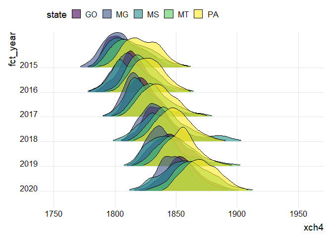<!-- -->

``` r
#Estatística Descritiva
df <- data_set_me |>
  group_by(year,state) |>
  summarise(
    N = length(xch4),
    MIN = min(xch4),
    MEAN = mean(xch4),
    MEDIAN = median(xch4),
    MAX = max(xch4),
    VARIANCIA  = var(xch4),
    STD_DV = sd(xch4),
    CV = 100*STD_DV/MEAN,
    SKW = agricolae::skewness(xch4),
    KRT = agricolae::kurtosis(xch4),
  )
writexl::write_xlsx(df, "output/estat-desc-xch4.xlsx")
# DT::datatable(df)
```

## Análise Geoestatística

### PASSO 1

``` r
# my_year = 2016
# my_state = "MG"
# grid <- grid_geral |> 
#   mutate(
#     state = ifelse(state == "DF","GO",state)
#       ) |> 
#   filter(state == my_state) |> 
#   select(X, Y)
# sp::gridded(grid) = ~ X + Y
```

``` r
# Isolando o banco de dados, pelo ano
data_set_aux  <- data_set_me |>
  filter(
    year == my_year,
    state == my_state) |>
  dplyr::select(longitude, latitude, xch4)

# vct_xch4 <- vector();dist_xch4 <- vector();
# lon_grid <- vector();lat_grid <- vector();
# for(i in 1:nrow(data_set_aux)){
#   d <- sqrt((data_set_aux$longitude[i] - grid_agg$X)^2 + 
#               (data_set_aux$lat[i] - grid_agg$Y)^2
#   )
#   min_index <- order(d)[1]
#   vct_xch4[i] <- data_set_aux$xch4[min_index]
#   dist_xch4[i] <- d[order(d)[1]]
#   lon_grid[i] <- grid_agg$X[min_index]
#   lat_grid[i] <- grid_agg$Y[min_index]
# }
# data_set_aux$dist_xch4 <- dist_xch4
# data_set_aux$xch4_new <- vct_xch4
# data_set_aux$lon_grid <- lon_grid
# data_set_aux$lat_grid <- lat_grid
# data_set_aux |> 
#   group_by(lon_grid,lat_grid) |> 
#   summarise(
#     xch4 = mean(xch4)
#   ) |> 
#   rename(longitude = lon_grid, latitude = lat_grid) -> data_set_aux
```

### PASSO 2 - Construção do Semivariograma Experimental

``` r
# Alteração no df
sp::coordinates(data_set_aux) = ~ longitude + latitude

# Fórmule é a variável que modelar, e o 1 da fórmula indica que ela
# não sofre transformação
form <- xch4 ~ 1
```

``` r
# Criando o Semivariograma Experimental.
vari_exp <- gstat::variogram(form, data = data_set_aux,
                      cressie = FALSE,
                      cutoff = 13, # distância máxima do semivariograma
                      width = 1.4) # distancia entre pontos
vari_exp  |>
  ggplot(aes(x=dist, y=gamma)) +
  geom_point() +
  labs(x="lag (º)",
       y=expression(paste(gamma,"(h)")))
```

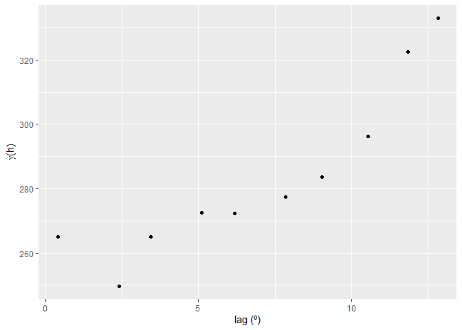<!-- -->

### Passo 3 - Ajuste dos modelos

``` r
patamar=450
alcance=15
epepita=1
modelo_1 <- gstat::fit.variogram(vari_exp,gstat::vgm(patamar,"Sph",alcance,epepita))
modelo_2 <- gstat::fit.variogram(vari_exp,gstat::vgm(patamar,"Exp",alcance,epepita))
modelo_3 <- gstat::fit.variogram(vari_exp,gstat::vgm(patamar,"Gau",alcance,epepita))
sqr.f1<-round(attr(modelo_1, "SSErr"),4); c01<-round(modelo_1$psill[[1]],4); c0_c11<-round(sum(modelo_1$psill),4);a1<-round(modelo_1$range[[2]],2)
sqr.f2<-round(attr(modelo_2, "SSErr"),4); c02<-round(modelo_2$psill[[1]],4); c0_c12<-round(sum(modelo_2$psill),4);a2<-round(3*modelo_2$range[[2]],2)
sqr.f3<-round(attr(modelo_3, "SSErr"),4); c03<-round(modelo_3$psill[[1]],4); c0_c13<-round(sum(modelo_3$psill),4);a3<-round(modelo_3$range[[2]]*(3^.5),2)

df_aux <- vari_exp |>
  mutate(
    gamma_m1 = ifelse(dist <= a1, c01 + (c0_c11-c01)*(3/2*(dist/a1)-1/2*(dist/a1)^3),c0_c11),
    gamma_m2 = c02 + (c0_c12-c02)*(1-exp(-3*(dist/a2))),
    gamma_m3 = c03 + (c0_c13-c03)*(1-exp(-3*(dist/a3)^2)),
    residuo_total = (gamma-mean(gamma))^2,
    residuo_mod_1 = (gamma - gamma_m1)^2,
    residuo_mod_2 = (gamma - gamma_m2)^2,
    residuo_mod_3 = (gamma - gamma_m3)^2
  ) |>
  summarise(
    r2_1=(sum(residuo_total) - sum(residuo_mod_1))/sum(residuo_total),
    r2_2=(sum(residuo_total) - sum(residuo_mod_2))/sum(residuo_total),
    r2_3=(sum(residuo_total) - sum(residuo_mod_3))/sum(residuo_total),
  )
r21<-as.vector(round(df_aux[1],4))
r22<-as.vector(round(df_aux[2],4))
r23<-as.vector(round(df_aux[3],4))

plot(vari_exp,
     model=modelo_1,
     col=1,pl=F,
     pch=16,
     cex=1.2,cex.main=7,
     ylab=list("Semivariância",cex=1.3),
     xlab=list("Distância de Separação h (m)",cex=1.3),
     main =paste("Esf(C0= ",c01,"; C0+C1= ",
                 c0_c11, "; a= ", a1,"; r2 = ",
                 r21,")",sep=""))
```

<!-- -->

``` r
plot(vari_exp,model=modelo_2, col=1,pl=F,pch=16,cex=1.2,cex.main=7,ylab=list("Semivariância",cex=1.3),xlab=list("Distância de Separação h (m)",cex=1.3),main =paste("Exp(C0= ",c02,"; C0+C1= ", c0_c12, "; a= ", a2,"; r2 = ", r22,")",sep=""))
```

<!-- -->

``` r
plot(vari_exp,model=modelo_3, col=1,pl=F,pch=16,cex=1.2,cex.main=7,ylab=list("Semivariância",cex=1.3),xlab=list("Distância de Separação h (m)",cex=1.3),main =paste("Gau(C0= ",c03,"; C0+C1= ", c0_c13, "; a= ", a3,"; r2 = ", r23,")",sep=""))
```

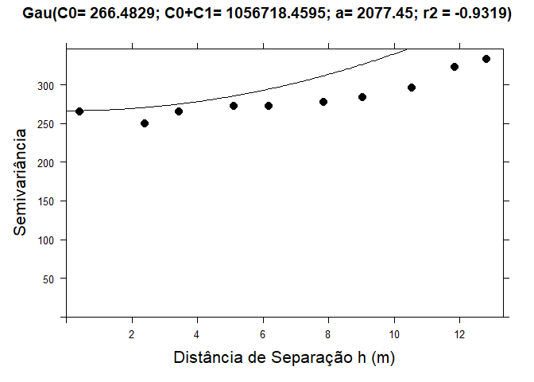<!-- -->

### Passo 4 - escolha do melhor modelo

``` r
# LOOCV - Leave one out cross validation
conjunto_validacao <- data_set_aux |>
  as_tibble() |>
  sample_n(50)
sp::coordinates(conjunto_validacao) = ~longitude + latitude
modelos<-list(modelo_1,modelo_2,modelo_3)
for(j in 1:3){
  est<-0
  for(i in 1:nrow(conjunto_validacao)){
    valid <- gstat::krige(formula=form, conjunto_validacao[-i,], conjunto_validacao, model=modelos[[j]])
    est[i]<-valid$var1.pred[i]
  }
  obs<-as.data.frame(conjunto_validacao)[,3]
  RMSE<-round((sum((obs-est)^2)/length(obs))^.5,3)
  mod<-lm(obs~est)
  b<-round(mod$coefficients[2],3)
  se<-round(summary(mod)$coefficients[4],3)
  r2<-round(summary(mod)$r.squared,3)
  a<-round(mod$coefficients[1],3)
  plot(est,obs,xlab="Estimado", ylab="Observado",pch=j,col="blue",
       main=paste("Modelo = ",modelos[[j]][2,1],"; Coef. Reg. = ", b, " (SE = ",se, ", r2 = ", r2,")\ny intersept = ",a,"RMSE = ",RMSE ))
  abline(lm(obs~est));
  abline(0,1,lty=3)
}
```

    ## [using ordinary kriging]
    ## [using ordinary kriging]
    ## [using ordinary kriging]
    ## [using ordinary kriging]
    ## [using ordinary kriging]
    ## [using ordinary kriging]
    ## [using ordinary kriging]
    ## [using ordinary kriging]
    ## [using ordinary kriging]
    ## [using ordinary kriging]
    ## [using ordinary kriging]
    ## [using ordinary kriging]
    ## [using ordinary kriging]
    ## [using ordinary kriging]
    ## [using ordinary kriging]
    ## [using ordinary kriging]
    ## [using ordinary kriging]
    ## [using ordinary kriging]
    ## [using ordinary kriging]
    ## [using ordinary kriging]
    ## [using ordinary kriging]
    ## [using ordinary kriging]
    ## [using ordinary kriging]
    ## [using ordinary kriging]
    ## [using ordinary kriging]
    ## [using ordinary kriging]
    ## [using ordinary kriging]
    ## [using ordinary kriging]
    ## [using ordinary kriging]
    ## [using ordinary kriging]
    ## [using ordinary kriging]
    ## [using ordinary kriging]
    ## [using ordinary kriging]
    ## [using ordinary kriging]
    ## [using ordinary kriging]
    ## [using ordinary kriging]
    ## [using ordinary kriging]
    ## [using ordinary kriging]
    ## [using ordinary kriging]
    ## [using ordinary kriging]
    ## [using ordinary kriging]
    ## [using ordinary kriging]
    ## [using ordinary kriging]
    ## [using ordinary kriging]
    ## [using ordinary kriging]
    ## [using ordinary kriging]
    ## [using ordinary kriging]
    ## [using ordinary kriging]
    ## [using ordinary kriging]
    ## [using ordinary kriging]

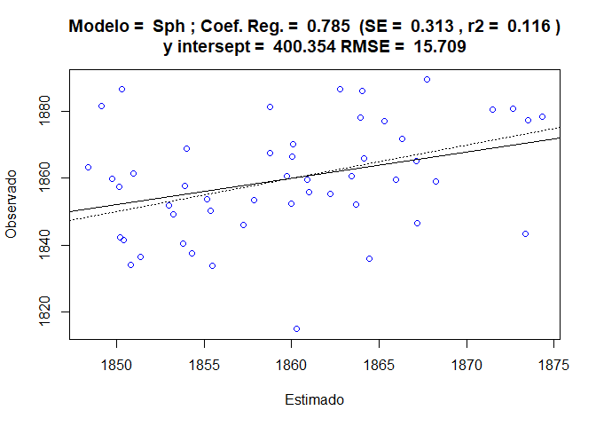<!-- -->

    ## [using ordinary kriging]
    ## [using ordinary kriging]
    ## [using ordinary kriging]
    ## [using ordinary kriging]
    ## [using ordinary kriging]
    ## [using ordinary kriging]
    ## [using ordinary kriging]
    ## [using ordinary kriging]
    ## [using ordinary kriging]
    ## [using ordinary kriging]
    ## [using ordinary kriging]
    ## [using ordinary kriging]
    ## [using ordinary kriging]
    ## [using ordinary kriging]
    ## [using ordinary kriging]
    ## [using ordinary kriging]
    ## [using ordinary kriging]
    ## [using ordinary kriging]
    ## [using ordinary kriging]
    ## [using ordinary kriging]
    ## [using ordinary kriging]
    ## [using ordinary kriging]
    ## [using ordinary kriging]
    ## [using ordinary kriging]
    ## [using ordinary kriging]
    ## [using ordinary kriging]
    ## [using ordinary kriging]
    ## [using ordinary kriging]
    ## [using ordinary kriging]
    ## [using ordinary kriging]
    ## [using ordinary kriging]
    ## [using ordinary kriging]
    ## [using ordinary kriging]
    ## [using ordinary kriging]
    ## [using ordinary kriging]
    ## [using ordinary kriging]
    ## [using ordinary kriging]
    ## [using ordinary kriging]
    ## [using ordinary kriging]
    ## [using ordinary kriging]
    ## [using ordinary kriging]
    ## [using ordinary kriging]
    ## [using ordinary kriging]
    ## [using ordinary kriging]
    ## [using ordinary kriging]
    ## [using ordinary kriging]
    ## [using ordinary kriging]
    ## [using ordinary kriging]
    ## [using ordinary kriging]
    ## [using ordinary kriging]

<!-- -->

    ## [using ordinary kriging]
    ## [using ordinary kriging]
    ## [using ordinary kriging]
    ## [using ordinary kriging]
    ## [using ordinary kriging]
    ## [using ordinary kriging]
    ## [using ordinary kriging]
    ## [using ordinary kriging]
    ## [using ordinary kriging]
    ## [using ordinary kriging]
    ## [using ordinary kriging]
    ## [using ordinary kriging]
    ## [using ordinary kriging]
    ## [using ordinary kriging]
    ## [using ordinary kriging]
    ## [using ordinary kriging]
    ## [using ordinary kriging]
    ## [using ordinary kriging]
    ## [using ordinary kriging]
    ## [using ordinary kriging]
    ## [using ordinary kriging]
    ## [using ordinary kriging]
    ## [using ordinary kriging]
    ## [using ordinary kriging]
    ## [using ordinary kriging]
    ## [using ordinary kriging]
    ## [using ordinary kriging]
    ## [using ordinary kriging]
    ## [using ordinary kriging]
    ## [using ordinary kriging]
    ## [using ordinary kriging]
    ## [using ordinary kriging]
    ## [using ordinary kriging]
    ## [using ordinary kriging]
    ## [using ordinary kriging]
    ## [using ordinary kriging]
    ## [using ordinary kriging]
    ## [using ordinary kriging]
    ## [using ordinary kriging]
    ## [using ordinary kriging]
    ## [using ordinary kriging]
    ## [using ordinary kriging]
    ## [using ordinary kriging]
    ## [using ordinary kriging]
    ## [using ordinary kriging]
    ## [using ordinary kriging]
    ## [using ordinary kriging]
    ## [using ordinary kriging]
    ## [using ordinary kriging]
    ## [using ordinary kriging]

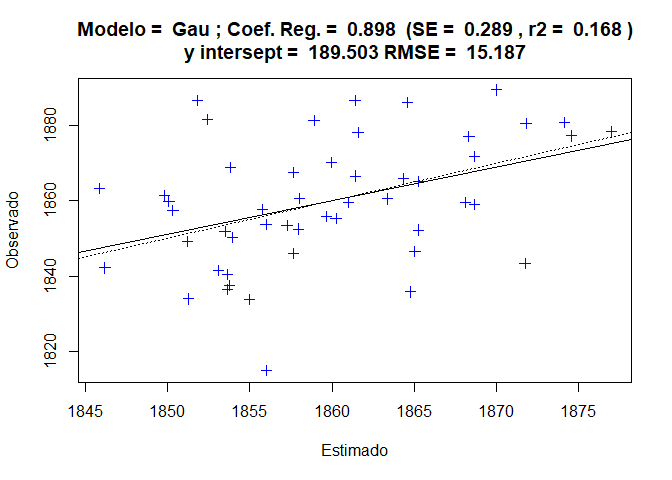<!-- -->

### Passo 5 - Selecionado o melhor modelo, vamos guardá-lo

``` r
modelo <- modelo_3 ## sempre modificar
# Salvando os parâmetros dos melhores modelo
model <- modelo |> slice(2) |> pull(model)
rss <- round(attr(modelo, "SSErr"),4) 
c0 <- round(modelo$psill[[1]],4) 
c0_c1 <- round(sum(modelo$psill),4)
a <- ifelse(model == "Gau", round(modelo$range[[2]]*(3^.5),2),
            ifelse(model == "Exp",round(3*modelo$range[[2]],2),
            round(modelo$range[[2]],2)))
r2 <- ifelse(model == "Gau", r23,
            ifelse(model == "Exp",r22,
            r21)) |> pluck(1)
tibble(
  my_state, my_year, model, c0, c0_c1, a, rss, r2
) |> mutate(gde = c0/c0_c1, .after = "a") |>
  rename(state=my_state,year=my_year) |> 
  write_csv(paste0("output/best-fit/",paste(my_state,collapse = "_"),"-",my_year,"-xch4.csv"))

ls_csv <- list.files("output/best-fit/",full.names = TRUE,pattern = "-xch4.csv")
map_df(ls_csv, read_csv) |> 
  writexl::write_xlsx("output/semivariogram-models-xch4.xlsx")
png(filename = paste0("output/semivariogram-img/semivar-xch4-",
                      paste(my_state,collapse = "_"),"-",my_year,".png"),
    width = 800, height = 600)
plot(vari_exp,model=modelo,cex.lab=2, col=1,pl=F,pch=16,cex=2.2,ylab=list("Semivariância",cex=2.3),xlab=list("Distância de Separação h (m)",cex=2.3,cex.axis=4))
dev.off()
```

    ## png 
    ##   2

### Passo 6 - Krigagem Ordinária - interpolação em locais não amostrados

``` r
# ko_variavel <- gstat::krige(formula=form, data_set_aux, grid, model=modelo,
#                     block=c(0.1,0.1),
#                      nsim=0,
#                      na.action=na.pass,
#                      debug.level=-1
# )
```

## Passo 7 Visualização dos padrões espaciais e armazenamento dos dados e magem.

``` r
# mapa <- as.tibble(ko_variavel) |>
#   ggplot(aes(x=X, y=Y)) +
#   geom_tile(aes(fill = var1.pred)) +
#   scale_fill_viridis_c() +
#   coord_equal() +
#   labs(x="Longitude",
#        y="Latitude",
#        fill="xch4") +
#   theme_bw()
# mapa
# ggsave(paste0("output/maps-kgr/kgr-xch4-",paste(my_state,collapse = "_"),"-",my_year,".png"), plot = mapa, width = 10, height = 8, dpi = 300)
# df <- ko_variavel |>
#   as.tibble() |>
#   mutate(var1.var = sqrt(var1.var))
# write_rds(df,paste0("output/maps-kgr/kgr-xch4-",paste(my_state,collapse = "_"),"-",my_year,".rds"))
```

# Análise para SIF

## Carregando Pacotes

## Filtrando a Base

``` r
### Base de dados inicial
data_set <- read_rds("data/oco2-sif.rds") |> 
  filter(year >= 2015 & year <= 2020,
         sif >= -1 & sif <= 5) |> 
  mutate(
    state = ifelse(state=="DF","GO",state)
  ) |> 
  select(-flag_nordeste, -flag_br)
glimpse(data_set)
```

    ## Rows: 34,787
    ## Columns: 25
    ## $ longitude                                                     <dbl> -52.5, -…
    ## $ longitude_bnds                                                <chr> "-53.0:-…
    ## $ latitude                                                      <dbl> -4.5, -3…
    ## $ latitude_bnds                                                 <chr> "-5.0:-4…
    ## $ time_yyyymmddhhmmss                                           <dbl> 2.01501e…
    ## $ time_bnds_yyyymmddhhmmss                                      <chr> "2015010…
    ## $ altitude_km                                                   <dbl> 2955.042…
    ## $ alt_bnds_km                                                   <chr> "0.0:591…
    ## $ fluorescence_radiance_757nm_uncert_idp_ph_sec_1_m_2_sr_1_um_1 <dbl> 7.538797…
    ## $ fluorescence_radiance_757nm_idp_ph_sec_1_m_2_sr_1_um_1        <dbl> 2.977973…
    ## $ xco2_moles_mole_1                                             <dbl> 0.000393…
    ## $ aerosol_total_aod                                             <dbl> 0.157814…
    ## $ fluorescence_offset_relative_771nm_idp                        <dbl> 0.020921…
    ## $ fluorescence_at_reference_ph_sec_1_m_2_sr_1_um_1              <dbl> 4.183452…
    ## $ fluorescence_radiance_771nm_idp_ph_sec_1_m_2_sr_1_um_1        <dbl> 3.720872…
    ## $ fluorescence_offset_relative_757nm_idp                        <dbl> 0.016250…
    ## $ fluorescence_radiance_771nm_uncert_idp_ph_sec_1_m_2_sr_1_um_1 <dbl> 5.870890…
    ## $ XCO2                                                          <dbl> 385.1973…
    ## $ xco2                                                          <dbl> 393.0661…
    ## $ date                                                          <dttm> 2015-01…
    ## $ year                                                          <dbl> 2015, 20…
    ## $ month                                                         <dbl> 1, 1, 1,…
    ## $ day                                                           <int> 1, 1, 1,…
    ## $ sif                                                           <dbl> 1.110144…
    ## $ state                                                         <chr> "PA", "P…

``` r
#Carrega a base filtrada
data_set_me <- data_set |>
  filter( 
    state %in% estados
  )
# Resumo da base
glimpse(data_set_me)
```

    ## Rows: 14,294
    ## Columns: 25
    ## $ longitude                                                     <dbl> -52.5, -…
    ## $ longitude_bnds                                                <chr> "-53.0:-…
    ## $ latitude                                                      <dbl> -4.5, -3…
    ## $ latitude_bnds                                                 <chr> "-5.0:-4…
    ## $ time_yyyymmddhhmmss                                           <dbl> 2.01501e…
    ## $ time_bnds_yyyymmddhhmmss                                      <chr> "2015010…
    ## $ altitude_km                                                   <dbl> 2955.042…
    ## $ alt_bnds_km                                                   <chr> "0.0:591…
    ## $ fluorescence_radiance_757nm_uncert_idp_ph_sec_1_m_2_sr_1_um_1 <dbl> 7.538797…
    ## $ fluorescence_radiance_757nm_idp_ph_sec_1_m_2_sr_1_um_1        <dbl> 2.977973…
    ## $ xco2_moles_mole_1                                             <dbl> 0.000393…
    ## $ aerosol_total_aod                                             <dbl> 0.157814…
    ## $ fluorescence_offset_relative_771nm_idp                        <dbl> 0.020921…
    ## $ fluorescence_at_reference_ph_sec_1_m_2_sr_1_um_1              <dbl> 4.183452…
    ## $ fluorescence_radiance_771nm_idp_ph_sec_1_m_2_sr_1_um_1        <dbl> 3.720872…
    ## $ fluorescence_offset_relative_757nm_idp                        <dbl> 0.016250…
    ## $ fluorescence_radiance_771nm_uncert_idp_ph_sec_1_m_2_sr_1_um_1 <dbl> 5.870890…
    ## $ XCO2                                                          <dbl> 385.1973…
    ## $ xco2                                                          <dbl> 393.0661…
    ## $ date                                                          <dttm> 2015-01…
    ## $ year                                                          <dbl> 2015, 20…
    ## $ month                                                         <dbl> 1, 1, 1,…
    ## $ day                                                           <int> 1, 1, 1,…
    ## $ sif                                                           <dbl> 1.110144…
    ## $ state                                                         <chr> "PA", "P…

``` r
#Gráficos
# Histogramas
data_set_me |>
  ggplot(aes(x=sif)) +
  geom_histogram(color="black",fill="gray",
                 bins = 30) +
  facet_wrap(~year, scales = "free") +
  theme_bw()
```

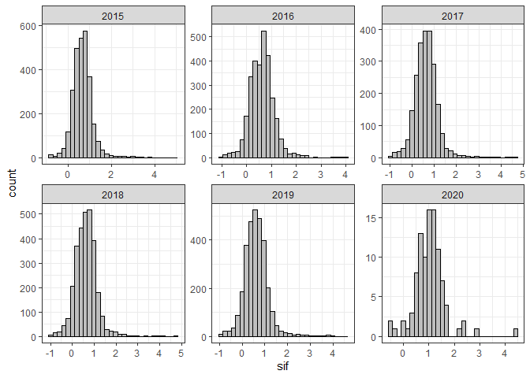<!-- -->

``` r
data_set_me |>
  mutate(
  fct_year = fct_rev(as.factor(year)),
  ) |>
  ggplot(aes(y=fct_year)) +
  geom_density_ridges(rel_min_height = 0.03,
                      aes(x=sif, fill=state),
                      alpha = .6, color = "black"
  ) +
  scale_fill_viridis_d() +
  theme_ridges() +
  theme(
    legend.position = "top"
  )
```

<!-- -->

``` r
#Estatística Descritiva
df <- data_set_me |>
  group_by(year,state) |>
  summarise(
    N = length(sif),
    MIN = min(sif),
    MEAN = mean(sif),
    MEDIAN = median(sif),
    MAX = max(sif),
    VARIANCIA  = var(sif),
    STD_DV = sd(sif),
    CV = 100*STD_DV/MEAN,
    SKW = agricolae::skewness(sif),
    KRT = agricolae::kurtosis(sif),
  )
writexl::write_xlsx(df,"output/estat-desc-sif.xlsx")
# DT::datatable(df)
```

## Análise Geoestatística

### PASSO 1

``` r
# my_year = 2015
# my_state = "MT"
# Criar o adensamento de pontos
# grid <- grid_geral |> 
#   mutate(
#     state = ifelse(state == "DF","GO",state)
#       ) |> 
#   filter(state == my_state) |> 
#   select(X, Y)
# sp::gridded(grid) = ~ X + Y
```

``` r
# Isolando o banco de dados, pelo ano
data_set_aux  <- data_set_me |>
  filter(
    year == my_year,
    state %in% my_state) |>
  group_by(latitude, longitude) |> 
  summarise(
    sif = mean(sif, na.rm = TRUE)
  ) |> 
  dplyr::select(longitude, latitude, sif)

# vct_sif <- vector();dist_sif <- vector();
# lon_grid <- vector();lat_grid <- vector();
# for(i in 1:nrow(data_set_aux)){
#   d <- sqrt((data_set_aux$longitude[i] - grid_agg$X)^2 + 
#               (data_set_aux$lat[i] - grid_agg$Y)^2
#   )
#   min_index <- order(d)[1]
#   vct_sif[i] <- data_set_aux$sif[min_index]
#   dist_sif[i] <- d[order(d)[1]]
#   lon_grid[i] <- grid_agg$X[min_index]
#   lat_grid[i] <- grid_agg$Y[min_index]
# }
# data_set_aux$dist_sif <- dist_sif
# data_set_aux$sif_new <- vct_sif
# data_set_aux$lon_grid <- lon_grid
# data_set_aux$lat_grid <- lat_grid
# data_set_aux |> 
#   group_by(lon_grid,lat_grid) |> 
#   summarise(
#     sif = mean(sif)
#   ) |> 
#   rename(longitude = lon_grid, latitude = lat_grid) -> data_set_aux
```

### PASSO 2 - Construção do Semivariograma Experimental

``` r
# Alteração no df
sp::coordinates(data_set_aux) = ~ longitude + latitude

# Fórmule é a variável que modelar, e o 1 da fórmula indica que ela
# não sofre transformação
form <- sif ~ 1
```

``` r
# Criando o Semivariograma Experimental.
vari_exp <- gstat::variogram(form, data = data_set_aux,
                      cressie = FALSE,
                      cutoff = 21, # distância máxima do semivariograma
                      width = 01,
                      cloud = FALSE) # distancia entre ponts
vari_exp  |>
  ggplot(aes(x=dist, y=gamma)) +
  geom_point() +
  labs(x="lag (º)",
       y=expression(paste(gamma,"(h)")))
```

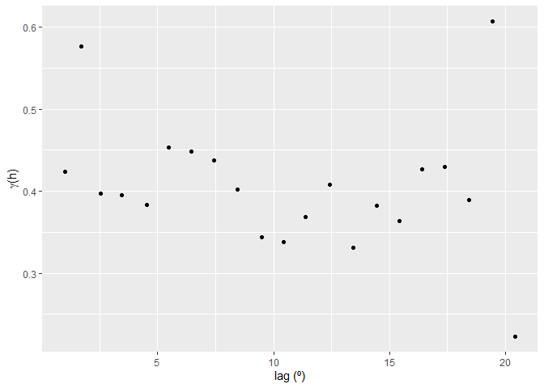<!-- -->

### Passo 3 - Ajuste dos modelos

``` r
patamar=0.08
alcance=15
epepita=0.01
modelo_1 <- gstat::fit.variogram(vari_exp,gstat::vgm(patamar,"Sph",alcance,epepita))
modelo_2 <- gstat::fit.variogram(vari_exp,gstat::vgm(patamar,"Exp",alcance,epepita))
modelo_3 <- gstat::fit.variogram(vari_exp,gstat::vgm(patamar,"Gau",alcance,epepita))
sqr.f1<-round(attr(modelo_1, "SSErr"),4); c01<-round(modelo_1$psill[[1]],4); c0_c11<-round(sum(modelo_1$psill),4);a1<-round(modelo_1$range[[2]],2)
sqr.f2<-round(attr(modelo_2, "SSErr"),4); c02<-round(modelo_2$psill[[1]],4); c0_c12<-round(sum(modelo_2$psill),4);a2<-round(3*modelo_2$range[[2]],2)
sqr.f3<-round(attr(modelo_3, "SSErr"),4); c03<-round(modelo_3$psill[[1]],4); c0_c13<-round(sum(modelo_3$psill),4);a3<-round(modelo_3$range[[2]]*(3^.5),2)

df_aux <- vari_exp |>
  mutate(
    gamma_m1 = ifelse(dist <= a1, c01 + (c0_c11-c01)*(3/2*(dist/a1)-1/2*(dist/a1)^3),c0_c11),
    gamma_m2 = c02 + (c0_c12-c02)*(1-exp(-3*(dist/a2))),
    gamma_m3 = c03 + (c0_c13-c03)*(1-exp(-3*(dist/a3)^2)),
    residuo_total = (gamma-mean(gamma))^2,
    residuo_mod_1 = (gamma - gamma_m1)^2,
    residuo_mod_2 = (gamma - gamma_m2)^2,
    residuo_mod_3 = (gamma - gamma_m3)^2
  ) |>
  summarise(
    r2_1=(sum(residuo_total) - sum(residuo_mod_1))/sum(residuo_total),
    r2_2=(sum(residuo_total) - sum(residuo_mod_2))/sum(residuo_total),
    r2_3=(sum(residuo_total) - sum(residuo_mod_3))/sum(residuo_total),
  )
r21<-as.vector(round(df_aux[1],4))
r22<-as.vector(round(df_aux[2],4))
r23<-as.vector(round(df_aux[3],4))

plot(vari_exp,
     model=modelo_1,
     col=1,pl=F,
     pch=16,
     cex=1.2,cex.main=7,
     ylab=list("Semivariância",cex=1.3),
     xlab=list("Distância de Separação h (m)",cex=1.3),
     main =paste("Esf(C0= ",c01,"; C0+C1= ",
                 c0_c11, "; a= ", a1,"; r2 = ",
                 r21,")",sep=""))
```

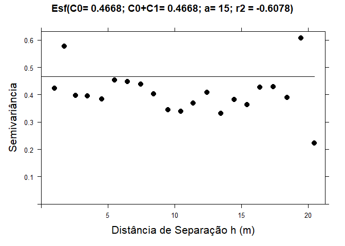<!-- -->

``` r
plot(vari_exp,model=modelo_2, col=1,pl=F,pch=16,cex=1.2,cex.main=7,ylab=list("Semivariância",cex=1.3),xlab=list("Distância de Separação h (m)",cex=1.3),main =paste("Exp(C0= ",c02,"; C0+C1= ", c0_c12, "; a= ", a2,"; r2 = ", r22,")",sep=""))
```

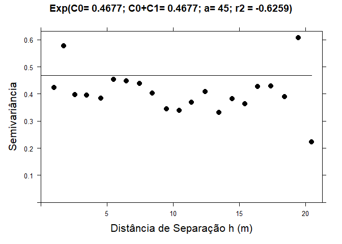<!-- -->

``` r
plot(vari_exp,model=modelo_3, col=1,pl=F,pch=16,cex=1.2,cex.main=7,ylab=list("Semivariância",cex=1.3),xlab=list("Distância de Separação h (m)",cex=1.3),main =paste("Gau(C0= ",c03,"; C0+C1= ", c0_c13, "; a= ", a3,"; r2 = ", r23,")",sep=""))
```

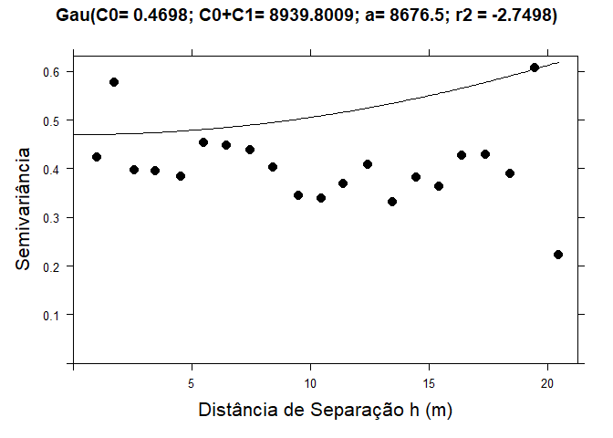<!-- -->

### Passo 4 - escolha do melhor modelo

``` r
# LOOCV - Leave one out cross validation
conjunto_validacao <- data_set_aux |>
  as_tibble() |>
  sample_n(50)
sp::coordinates(conjunto_validacao) = ~longitude + latitude
modelos<-list(modelo_1,modelo_2,modelo_3)
for(j in 1:3){
  est<-0
  for(i in 1:nrow(conjunto_validacao)){
    valid <- gstat::krige(formula=form, conjunto_validacao[-i,], conjunto_validacao, model=modelos[[j]])
    est[i]<-valid$var1.pred[i]
  }
  obs<-as.data.frame(conjunto_validacao)[,3]
  RMSE<-round((sum((obs-est)^2)/length(obs))^.5,3)
  mod<-lm(obs~est)
  b<-round(mod$coefficients[2],3)
  se<-round(summary(mod)$coefficients[4],3)
  r2<-round(summary(mod)$r.squared,3)
  a<-round(mod$coefficients[1],3)
  plot(est,obs,xlab="Estimado", ylab="Observado",pch=j,col="blue",
       main=paste("Modelo = ",modelos[[j]][2,1],"; Coef. Reg. = ", b, " (SE = ",se, ", r2 = ", r2,")\ny intersept = ",a,"RMSE = ",RMSE ))
  abline(lm(obs~est));
  abline(0,1,lty=3)
}
```

    ## [using ordinary kriging]
    ## [using ordinary kriging]
    ## [using ordinary kriging]
    ## [using ordinary kriging]
    ## [using ordinary kriging]
    ## [using ordinary kriging]
    ## [using ordinary kriging]
    ## [using ordinary kriging]
    ## [using ordinary kriging]
    ## [using ordinary kriging]
    ## [using ordinary kriging]
    ## [using ordinary kriging]
    ## [using ordinary kriging]
    ## [using ordinary kriging]
    ## [using ordinary kriging]
    ## [using ordinary kriging]
    ## [using ordinary kriging]
    ## [using ordinary kriging]
    ## [using ordinary kriging]
    ## [using ordinary kriging]
    ## [using ordinary kriging]
    ## [using ordinary kriging]
    ## [using ordinary kriging]
    ## [using ordinary kriging]
    ## [using ordinary kriging]
    ## [using ordinary kriging]
    ## [using ordinary kriging]
    ## [using ordinary kriging]
    ## [using ordinary kriging]
    ## [using ordinary kriging]
    ## [using ordinary kriging]
    ## [using ordinary kriging]
    ## [using ordinary kriging]
    ## [using ordinary kriging]
    ## [using ordinary kriging]
    ## [using ordinary kriging]
    ## [using ordinary kriging]
    ## [using ordinary kriging]
    ## [using ordinary kriging]
    ## [using ordinary kriging]
    ## [using ordinary kriging]
    ## [using ordinary kriging]
    ## [using ordinary kriging]
    ## [using ordinary kriging]
    ## [using ordinary kriging]
    ## [using ordinary kriging]
    ## [using ordinary kriging]
    ## [using ordinary kriging]
    ## [using ordinary kriging]
    ## [using ordinary kriging]

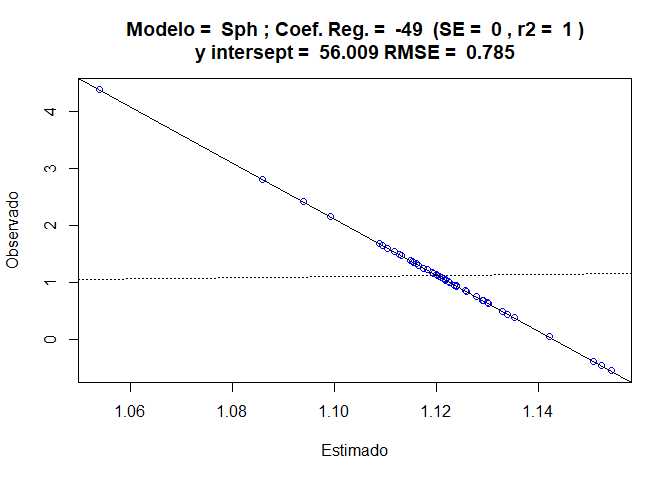<!-- -->

    ## [using ordinary kriging]
    ## [using ordinary kriging]
    ## [using ordinary kriging]
    ## [using ordinary kriging]
    ## [using ordinary kriging]
    ## [using ordinary kriging]
    ## [using ordinary kriging]
    ## [using ordinary kriging]
    ## [using ordinary kriging]
    ## [using ordinary kriging]
    ## [using ordinary kriging]
    ## [using ordinary kriging]
    ## [using ordinary kriging]
    ## [using ordinary kriging]
    ## [using ordinary kriging]
    ## [using ordinary kriging]
    ## [using ordinary kriging]
    ## [using ordinary kriging]
    ## [using ordinary kriging]
    ## [using ordinary kriging]
    ## [using ordinary kriging]
    ## [using ordinary kriging]
    ## [using ordinary kriging]
    ## [using ordinary kriging]
    ## [using ordinary kriging]
    ## [using ordinary kriging]
    ## [using ordinary kriging]
    ## [using ordinary kriging]
    ## [using ordinary kriging]
    ## [using ordinary kriging]
    ## [using ordinary kriging]
    ## [using ordinary kriging]
    ## [using ordinary kriging]
    ## [using ordinary kriging]
    ## [using ordinary kriging]
    ## [using ordinary kriging]
    ## [using ordinary kriging]
    ## [using ordinary kriging]
    ## [using ordinary kriging]
    ## [using ordinary kriging]
    ## [using ordinary kriging]
    ## [using ordinary kriging]
    ## [using ordinary kriging]
    ## [using ordinary kriging]
    ## [using ordinary kriging]
    ## [using ordinary kriging]
    ## [using ordinary kriging]
    ## [using ordinary kriging]
    ## [using ordinary kriging]
    ## [using ordinary kriging]

<!-- -->

    ## [using ordinary kriging]
    ## [using ordinary kriging]
    ## [using ordinary kriging]
    ## [using ordinary kriging]
    ## [using ordinary kriging]
    ## [using ordinary kriging]
    ## [using ordinary kriging]
    ## [using ordinary kriging]
    ## [using ordinary kriging]
    ## [using ordinary kriging]
    ## [using ordinary kriging]
    ## [using ordinary kriging]
    ## [using ordinary kriging]
    ## [using ordinary kriging]
    ## [using ordinary kriging]
    ## [using ordinary kriging]
    ## [using ordinary kriging]
    ## [using ordinary kriging]
    ## [using ordinary kriging]
    ## [using ordinary kriging]
    ## [using ordinary kriging]
    ## [using ordinary kriging]
    ## [using ordinary kriging]
    ## [using ordinary kriging]
    ## [using ordinary kriging]
    ## [using ordinary kriging]
    ## [using ordinary kriging]
    ## [using ordinary kriging]
    ## [using ordinary kriging]
    ## [using ordinary kriging]
    ## [using ordinary kriging]
    ## [using ordinary kriging]
    ## [using ordinary kriging]
    ## [using ordinary kriging]
    ## [using ordinary kriging]
    ## [using ordinary kriging]
    ## [using ordinary kriging]
    ## [using ordinary kriging]
    ## [using ordinary kriging]
    ## [using ordinary kriging]
    ## [using ordinary kriging]
    ## [using ordinary kriging]
    ## [using ordinary kriging]
    ## [using ordinary kriging]
    ## [using ordinary kriging]
    ## [using ordinary kriging]
    ## [using ordinary kriging]
    ## [using ordinary kriging]
    ## [using ordinary kriging]
    ## [using ordinary kriging]

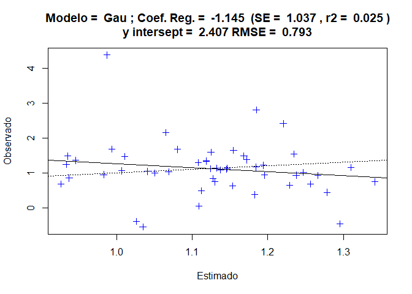<!-- -->

### Passo 5 - Selecionado o melhor modelo, vamos guardá-lo

``` r
modelo <- modelo_3 ## sempre modificar
# Salvando os parâmetros dos melhores modelo
model <- modelo |> slice(2) |> pull(model)
rss <- round(attr(modelo, "SSErr"),4) 
c0 <- round(modelo$psill[[1]],4) 
c0_c1 <- round(sum(modelo$psill),4)
a <- ifelse(model == "Gau", round(modelo$range[[2]]*(3^.5),2),
            ifelse(model == "Exp",round(3*modelo$range[[2]],2),
            round(modelo$range[[2]],2)))
r2 <- ifelse(model == "Gau", r23,
            ifelse(model == "Exp",r22,
            r21)) |> pluck(1)
tibble(
  my_state, my_year, model, c0, c0_c1, a, rss, r2
) |> mutate(gde = c0/c0_c1, .after = "a") |>
  rename(state=my_state,year=my_year) |> 
  write_csv(paste0("output/best-fit/",paste(my_state,collapse = "_"),"-",my_year,"-sif.csv"))

ls_csv <- list.files("output/best-fit/",full.names = TRUE,pattern = "-sif.csv")
map_df(ls_csv, read_csv) |> 
  writexl::write_xlsx("output/semivariogram-models-sif.xlsx")
png(filename = paste0("output/semivariogram-img/semivar-sif-",
                      my_state,"-",my_year,".png"),
    width = 800, height = 600)
plot(vari_exp,model=modelo,cex.lab=2, col=1,pl=F,pch=16,cex=2.2,ylab=list("Semivariância",cex=2.3),xlab=list("Distância de Separação h (m)",cex=2.3,cex.axis=4))
dev.off()
```

    ## png 
    ##   2

### Passo 6 - Krigagem Ordinária - interpolação em locais não amostrados

``` r
# ko_variavel <- gstat::krige(formula=form, data_set_aux, grid, model=modelo,
#                      block=c(0.1,0.1),
#                      nsim=0,
#                      na.action=na.pass,
#                      debug.level=-1
# )
```

## Passo 7 Visualização dos padrões espaciais e armazenamento dos dados e imagem.

``` r
# mapa <- as.tibble(ko_variavel) |>
#   ggplot(aes(x=X, y=Y)) +
#   geom_tile(aes(fill = var1.pred)) +
#   scale_fill_viridis_c() +
#   coord_equal() +
#   labs(x="Longitude",
#        y="Latitude",
#        fill="sif") +
#   theme_bw()
# mapa
# ggsave(paste0("output/maps-kgr/kgr-sif-",paste(my_state,collapse = "_"),"-",my_year,".png"), plot = mapa, width = 10, height = 8, dpi = 300)
# df <- ko_variavel |>
#   as.tibble() |>
#   mutate(var1.var = sqrt(var1.var))
# write_rds(df,paste0("output/maps-kgr/kgr-sif-",paste(my_state,collapse = "_"),"-",my_year,".rds"))
```

# Compilando os mapas krigados.

### Rodar somente após todos os mapas gerados

``` r
list_rds <- list.files("output/maps-kgr/",
           pattern = "_.*rds$",
           full.names = TRUE)
kgr_maps <- map_df(list_rds, rds_reader)
```

# Cálculo do Beta

``` r
grid_geral_state_city <- read_rds("data/grid-state-city.rds") |> 
  ungroup()
```

# Retirando atendência

``` r
# readr::write_rds(kgr_maps_group,"data/kgr-maps-cities-groups.rds")
a_co2 <- mod_trend_xco2$coefficients[[1]]
b_co2 <- mod_trend_xco2$coefficients[[2]]
a_ch4 <- mod_trend_xch4$coefficients[[1]]
b_ch4 <- mod_trend_xch4$coefficients[[2]]
glimpse(kgr_maps)
```

    ## Rows: 2,065,428
    ## Columns: 7
    ## $ variable  <chr> "sif", "sif", "sif", "sif", "sif", "sif", "sif", "sif", "sif…
    ## $ state     <chr> "MG_MT_MS_GO_PA_DF", "MG_MT_MS_GO_PA_DF", "MG_MT_MS_GO_PA_DF…
    ## $ year      <dbl> 2015, 2015, 2015, 2015, 2015, 2015, 2015, 2015, 2015, 2015, …
    ## $ X         <dbl> -54.28336, -54.23336, -55.38336, -55.33336, -55.28336, -55.2…
    ## $ Y         <dbl> -24.01858, -24.01858, -23.96858, -23.96858, -23.96858, -23.9…
    ## $ value     <dbl> 0.7541133, 0.7542637, 0.7486198, 0.7488217, 0.7490211, 0.749…
    ## $ value_std <dbl> 0.05062479, 0.05058431, 0.05196294, 0.05183781, 0.05171695, …

``` r
kgr_maps_detrend <- kgr_maps |>
  group_by(variable) |>
  mutate(
    value_est = ifelse(variable=="xco2",
                       a_co2+b_co2*(year-min(year)),
                       ifelse(variable=="xch4",
                              a_ch4+b_ch4*(year-min(year)),
                              value)),
    delta = ifelse(variable=="sif",value,value_est-value),
    value_detrend = ifelse(variable =="xco2", (a_co2-delta)-(mean(value)-a_co2),
                       ifelse(variable =="xch4",
                              (a_ch4-delta)-(mean(value)-a_ch4),value)),
    value = value_detrend
  ) |> ungroup() |>
  select(-value_est,-delta,-value_detrend)

kgr_maps_detrend |> 
  filter(variable == "xch4")
```

    ## # A tibble: 688,476 × 7
    ##    variable state              year     X     Y value value_std
    ##    <chr>    <chr>             <dbl> <dbl> <dbl> <dbl>     <dbl>
    ##  1 xch4     MG_MT_MS_GO_PA_DF  2015 -54.3 -24.0 1785.      3.16
    ##  2 xch4     MG_MT_MS_GO_PA_DF  2015 -54.2 -24.0 1785.      3.16
    ##  3 xch4     MG_MT_MS_GO_PA_DF  2015 -55.4 -24.0 1787.      3.27
    ##  4 xch4     MG_MT_MS_GO_PA_DF  2015 -55.3 -24.0 1786.      3.26
    ##  5 xch4     MG_MT_MS_GO_PA_DF  2015 -55.3 -24.0 1786.      3.25
    ##  6 xch4     MG_MT_MS_GO_PA_DF  2015 -55.2 -24.0 1786.      3.24
    ##  7 xch4     MG_MT_MS_GO_PA_DF  2015 -55.2 -24.0 1786.      3.23
    ##  8 xch4     MG_MT_MS_GO_PA_DF  2015 -55.1 -24.0 1786.      3.22
    ##  9 xch4     MG_MT_MS_GO_PA_DF  2015 -55.1 -24.0 1786.      3.21
    ## 10 xch4     MG_MT_MS_GO_PA_DF  2015 -55.0 -24.0 1786.      3.21
    ## # ℹ 688,466 more rows

## Cálculo do Beta para cada municípios

``` r
kgr_maps_detrend_city <- kgr_maps_detrend |> 
  select(-state) |> 
  left_join(
    grid_geral,
  by=c("X","Y")
  ) |> 
  group_by(variable, year) |> 
  mutate(
    ref_mean = mean(value, na.rm = TRUE),
    anomaly = value - ref_mean
  )
```

``` r
kgr_maps_nested <- kgr_maps_detrend_city |>
  group_by(variable,state,city,year) |>
  summarise(
    media = mean(value,na.rm = TRUE),
    desv_pad = mean(value_std),
    anomaly = mean(anomaly, na.rm = TRUE)
  ) |>
  group_by(variable,state,city) |>
  nest() |>
  ungroup()

kgr_maps_nested$data[[1]]
```

    ## # A tibble: 6 × 4
    ##    year media desv_pad anomaly
    ##   <dbl> <dbl>    <dbl>   <dbl>
    ## 1  2015 0.529   0.0236 -0.146 
    ## 2  2016 0.559   0.0165 -0.0752
    ## 3  2017 0.544   0.0636 -0.0973
    ## 4  2018 0.483   0.0275 -0.162 
    ## 5  2019 0.525   0.0662 -0.127 
    ## 6  2020 0.982   0.0857 -0.0760

``` r
get_reg_lin <- function(df, par_return = "beta"){
  x <- df$year
  y <- df$media
  mod <- lm(y~x)
  value <- mod$coefficients[[2]]
  if(par_return == "beta") return(value)
}

mean_anomaly <- function(df){
  x <- df$anomaly
  value <- mean(x, na.rm = TRUE)
  return(value)
}

kgr_maps_beta <- kgr_maps_nested |>
  mutate(
    beta = map(data,get_reg_lin),
    anomaly = map(data, mean_anomaly)
  ) |>
  select(-data) |>
  unnest()

glimpse(kgr_maps_beta)
```

    ## Rows: 4,347
    ## Columns: 5
    ## $ variable <chr> "sif", "sif", "sif", "sif", "sif", "sif", "sif", "sif", "sif"…
    ## $ state    <chr> "DF", "GO", "GO", "GO", "GO", "GO", "GO", "GO", "GO", "GO", "…
    ## $ city     <chr> "Brasília", "Abadia De Goiás", "Abadiânia", "Acreúna", "Adelâ…
    ## $ beta     <dbl> 0.06011311, 0.06689278, 0.06451485, 0.06739441, 0.06929618, 0…
    ## $ anomaly  <dbl> -0.11386511, -0.09241500, -0.09331475, -0.09655076, -0.088390…

## Mapeando o beta por cidades

``` r
city_kgr_beta <- left_join(
  citys |> filter(abbrev_state %in% estados) |> 
    mutate(
      abbrev_state = ifelse(abbrev_state =="DF", "GO", abbrev_state)
    ),
  kgr_maps_beta |>
    pivot_wider(
      names_from = variable,
      values_from = c(beta,anomaly)) |>
    rename(abbrev_state = state,name_muni =city),
           by=c("abbrev_state","name_muni"))
```

## Mapeando a anomalia

``` r
map(2015:2020, ~kgr_maps_detrend_city |> 
  filter(variable=="sif",year==.x) |> 
  ggplot(aes(x=X, y=Y)) +
  geom_tile(aes(fill = anomaly)) +
  scale_fill_viridis_c(option = "mako") +
  coord_equal() +
  labs(x="Longitude",
       y="Latitude",
       fill="anomaly_sif") +
  theme_bw()
)
```

    ## [[1]]

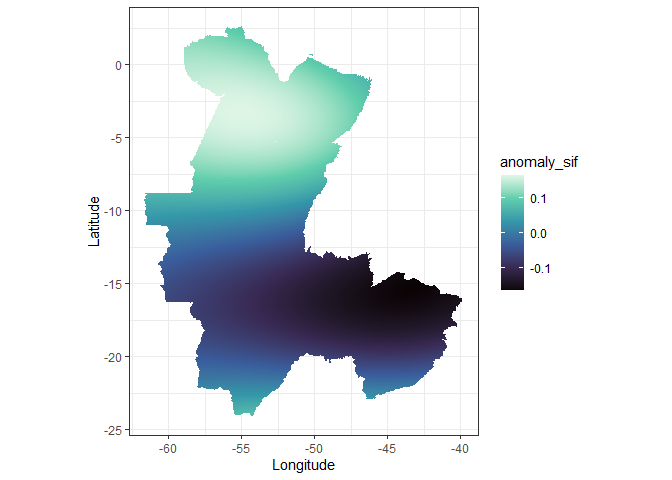<!-- -->

    ## 
    ## [[2]]

<!-- -->

    ## 
    ## [[3]]

<!-- -->

    ## 
    ## [[4]]

<!-- -->

    ## 
    ## [[5]]

<!-- -->

    ## 
    ## [[6]]

<!-- -->

``` r
map(2015:2020, ~kgr_maps_detrend_city |> 
  filter(variable=="xch4",year==.x) |> 
  ggplot(aes(x=X, y=Y)) +
  geom_tile(aes(fill = anomaly)) +
  scale_fill_viridis_c(option = "mako") +
  coord_equal() +
  labs(x="Longitude",
       y="Latitude",
       fill="anomaly_xch4") +
  theme_bw()
)
```

    ## [[1]]

<!-- -->

    ## 
    ## [[2]]

<!-- -->

    ## 
    ## [[3]]

<!-- -->

    ## 
    ## [[4]]

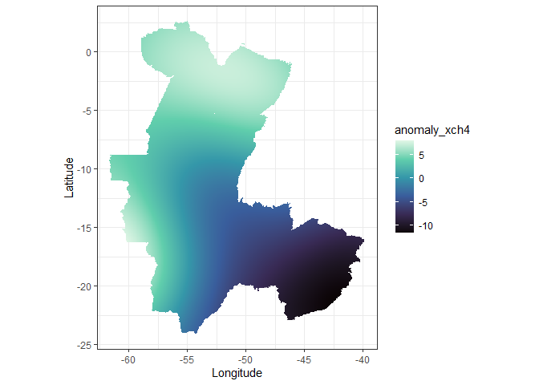<!-- -->

    ## 
    ## [[5]]

<!-- -->

    ## 
    ## [[6]]

<!-- -->

``` r
map(2015:2020, ~kgr_maps_detrend_city |> 
  filter(variable=="xco2",year==.x) |> 
  ggplot(aes(x=X, y=Y)) +
  geom_tile(aes(fill = anomaly)) +
  scale_fill_viridis_c(option = "mako") +
  coord_equal() +
  labs(x="Longitude",
       y="Latitude",
       fill="anomaly_xco2") +
  theme_bw()
)
```

    ## [[1]]

<!-- -->

    ## 
    ## [[2]]

<!-- -->

    ## 
    ## [[3]]

<!-- -->

    ## 
    ## [[4]]

<!-- -->

    ## 
    ## [[5]]

<!-- -->

    ## 
    ## [[6]]

<!-- -->

## Mapa dos Betas e Anomalias médias

``` r
city_kgr_beta |>
     ggplot() +
     geom_sf(aes(fill=beta_sif), color="transparent",
             size=.05, show.legend = TRUE)  +
   geom_sf(data=mapas_contorno1, fill="transparent", color="red", size=3, show.legend = FALSE) +
   geom_sf(data=mapas_contorno2, fill="transparent", color="red", size=3, show.legend = FALSE) +
   geom_sf(data=mapas_contorno3, fill="transparent", color="red", size=3, show.legend = FALSE) +
   geom_sf(data=mapas_contorno4, fill="transparent", color="red", size=3, show.legend = FALSE) +
   geom_sf(data=mapas_contorno5, fill="transparent", color="red", size=3, show.legend = FALSE) +
     theme_bw() +
   theme(
     axis.text.x = element_text(size = rel(.9), color = "black"),
     axis.title.x = element_text(size = rel(1.1), color = "black"),
     axis.text.y = element_text(size = rel(.9), color = "black"),
     axis.title.y = element_text(size = rel(1.1), color = "black"),
     legend.text = element_text(size = rel(1), color = "black"),
     legend.title = element_text(face = 'bold', size = rel(1.2)),
     legend.position = c(1.29, .5)
     ) +
   labs(fill = 'Beta_sif',
         x = 'Longitude',
         y = 'Latitude') +
     scale_fill_viridis_c(option = "inferno")
```

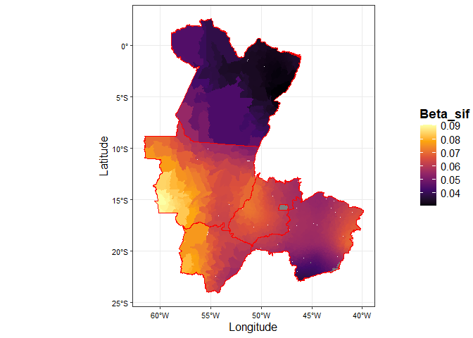<!-- -->

``` r
city_kgr_beta |>
     ggplot() +
     geom_sf(aes(fill=anomaly_sif), color="transparent",
             size=.05, show.legend = TRUE)  +
   geom_sf(data=mapas_contorno1, fill="transparent", color="red", size=3, show.legend = FALSE) +
   geom_sf(data=mapas_contorno2, fill="transparent", color="red", size=3, show.legend = FALSE) +
   geom_sf(data=mapas_contorno3, fill="transparent", color="red", size=3, show.legend = FALSE) +
   geom_sf(data=mapas_contorno4, fill="transparent", color="red", size=3, show.legend = FALSE) +
   geom_sf(data=mapas_contorno5, fill="transparent", color="red", size=3, show.legend = FALSE) +
     theme_bw() +
   theme(
     axis.text.x = element_text(size = rel(.9), color = "black"),
     axis.title.x = element_text(size = rel(1.1), color = "black"),
     axis.text.y = element_text(size = rel(.9), color = "black"),
     axis.title.y = element_text(size = rel(1.1), color = "black"),
     legend.text = element_text(size = rel(1), color = "black"),
     legend.title = element_text(face = 'bold', size = rel(1.2)),
     legend.position = c(1.29, .5)
     ) +
   labs(fill = 'Anomaly_sif',
         x = 'Longitude',
         y = 'Latitude') +
     scale_fill_viridis_c(option = "mako")
```

<!-- -->

``` r
city_kgr_beta |>
     ggplot() +
     geom_sf(aes(fill=beta_xch4), color="transparent",
             size=.05, show.legend = TRUE)  +
   geom_sf(data=mapas_contorno1, fill="transparent", color="red", size=3, show.legend = FALSE) +
   geom_sf(data=mapas_contorno2, fill="transparent", color="red", size=3, show.legend = FALSE) +
   geom_sf(data=mapas_contorno3, fill="transparent", color="red", size=3, show.legend = FALSE) +
   geom_sf(data=mapas_contorno4, fill="transparent", color="red", size=3, show.legend = FALSE) +
   geom_sf(data=mapas_contorno5, fill="transparent", color="red", size=3, show.legend = FALSE) +
     theme_bw() +
   theme(
     axis.text.x = element_text(size = rel(.9), color = "black"),
     axis.title.x = element_text(size = rel(1.1), color = "black"),
     axis.text.y = element_text(size = rel(.9), color = "black"),
     axis.title.y = element_text(size = rel(1.1), color = "black"),
     legend.text = element_text(size = rel(1), color = "black"),
     legend.title = element_text(face = 'bold', size = rel(1.2)),
     legend.position = c(1.29, .5)
     ) +
   labs(fill = 'Beta_xch4',
         x = 'Longitude',
         y = 'Latitude') +
     scale_fill_viridis_c(option = "inferno")
```

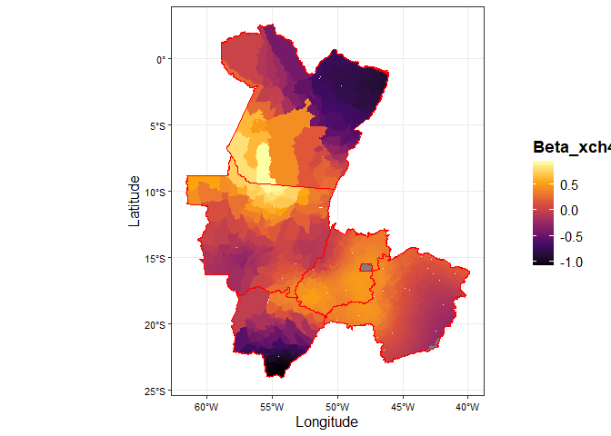<!-- -->

``` r
city_kgr_beta |>
     ggplot() +
     geom_sf(aes(fill=anomaly_xch4), color="transparent",
             size=.05, show.legend = TRUE)  +
   geom_sf(data=mapas_contorno1, fill="transparent", color="red", size=3, show.legend = FALSE) +
   geom_sf(data=mapas_contorno2, fill="transparent", color="red", size=3, show.legend = FALSE) +
   geom_sf(data=mapas_contorno3, fill="transparent", color="red", size=3, show.legend = FALSE) +
   geom_sf(data=mapas_contorno4, fill="transparent", color="red", size=3, show.legend = FALSE) +
   geom_sf(data=mapas_contorno5, fill="transparent", color="red", size=3, show.legend = FALSE) +
     theme_bw() +
   theme(
     axis.text.x = element_text(size = rel(.9), color = "black"),
     axis.title.x = element_text(size = rel(1.1), color = "black"),
     axis.text.y = element_text(size = rel(.9), color = "black"),
     axis.title.y = element_text(size = rel(1.1), color = "black"),
     legend.text = element_text(size = rel(1), color = "black"),
     legend.title = element_text(face = 'bold', size = rel(1.2)),
     legend.position = c(1.29, .5)
     ) +
   labs(fill = 'Anomaly_xch4',
         x = 'Longitude',
         y = 'Latitude') +
     scale_fill_viridis_c(option = "mako")
```

<!-- -->

``` r
city_kgr_beta |>
     ggplot() +
     geom_sf(aes(fill=beta_xco2), color="transparent",
             size=.05, show.legend = TRUE)  +
   geom_sf(data=mapas_contorno1, fill="transparent", color="red", size=3, show.legend = FALSE) +
   geom_sf(data=mapas_contorno2, fill="transparent", color="red", size=3, show.legend = FALSE) +
   geom_sf(data=mapas_contorno3, fill="transparent", color="red", size=3, show.legend = FALSE) +
   geom_sf(data=mapas_contorno4, fill="transparent", color="red", size=3, show.legend = FALSE) +
   geom_sf(data=mapas_contorno5, fill="transparent", color="red", size=3, show.legend = FALSE) +
     theme_bw() +
   theme(
     axis.text.x = element_text(size = rel(.9), color = "black"),
     axis.title.x = element_text(size = rel(1.1), color = "black"),
     axis.text.y = element_text(size = rel(.9), color = "black"),
     axis.title.y = element_text(size = rel(1.1), color = "black"),
     legend.text = element_text(size = rel(1), color = "black"),
     legend.title = element_text(face = 'bold', size = rel(1.2)),
     legend.position = c(1.29, .5)
     ) +
   labs(fill = 'Beta_xco2',
         x = 'Longitude',
         y = 'Latitude') +
     scale_fill_viridis_c(option = "inferno")
```

<!-- -->

``` r
city_kgr_beta |>
     ggplot() +
     geom_sf(aes(fill=anomaly_xco2), color="transparent",
             size=.05, show.legend = TRUE)  +
   geom_sf(data=mapas_contorno1, fill="transparent", color="red", size=3, show.legend = FALSE) +
   geom_sf(data=mapas_contorno2, fill="transparent", color="red", size=3, show.legend = FALSE) +
   geom_sf(data=mapas_contorno3, fill="transparent", color="red", size=3, show.legend = FALSE) +
   geom_sf(data=mapas_contorno4, fill="transparent", color="red", size=3, show.legend = FALSE) +
   geom_sf(data=mapas_contorno5, fill="transparent", color="red", size=3, show.legend = FALSE) +
     theme_bw() +
   theme(
     axis.text.x = element_text(size = rel(.9), color = "black"),
     axis.title.x = element_text(size = rel(1.1), color = "black"),
     axis.text.y = element_text(size = rel(.9), color = "black"),
     axis.title.y = element_text(size = rel(1.1), color = "black"),
     legend.text = element_text(size = rel(1), color = "black"),
     legend.title = element_text(face = 'bold', size = rel(1.2)),
     legend.position = c(1.29, .5)
     ) +
   labs(fill = 'Anomaly_xco2',
         x = 'Longitude',
         y = 'Latitude') +
     scale_fill_viridis_c(option = "mako")
```

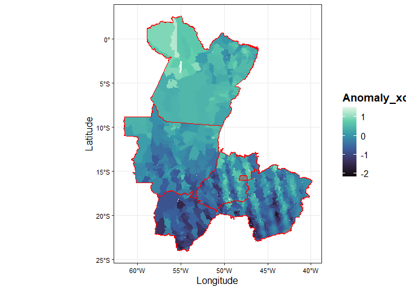<!-- -->

## Inspeção por estado

``` r
variables <- c("beta_sif","beta_xch4","beta_xco2","anomaly_sif","anomaly_xch4","anomaly_xco2")
my_plot_map_beta <- function(.estado, .variable){
  city_kgr_beta |>
    filter(abbrev_state == .estado) |>
    ggplot() +
     geom_sf(aes_string(fill=.variable), color="black",
              size=.05, show.legend = TRUE)  +
    theme_bw() +
    theme(
      axis.text.x = element_text(size = rel(.9), color = "black"),
      axis.title.x = element_text(size = rel(.5), color = "black"),
      axis.text.y = element_text(size = rel(.9), color = "black"),
      axis.title.y = element_text(size = rel(.5), color = "black"),
      # legend.text = element_text(size = rel(1), color = "black"),
      # legend.title = element_text(face = 'bold', size = rel(1)),
      # legend.position = c(1.29, .5)
    ) +
     labs(fill =.variable,
          x = 'Longitude',
          y = 'Latitude') +
    scale_fill_gradient(low="yellow",high = "red")
}
my_plot_map_beta("GO", "beta_xch4")
```

<!-- -->

``` r
map(estados[-6],my_plot_map_beta,.variable="beta_xco2")
```

    ## [[1]]

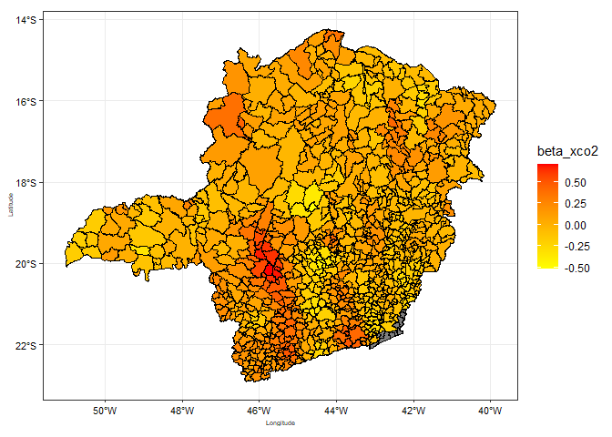<!-- -->

    ## 
    ## [[2]]

<!-- -->

    ## 
    ## [[3]]

<!-- -->

    ## 
    ## [[4]]

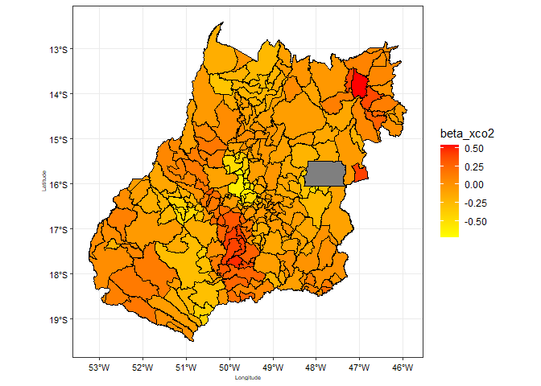<!-- -->

    ## 
    ## [[5]]

<!-- -->

``` r
map(estados[-6],my_plot_map_beta,.variable="anomaly_xco2")
```

    ## [[1]]

<!-- -->

    ## 
    ## [[2]]

<!-- -->

    ## 
    ## [[3]]

<!-- -->

    ## 
    ## [[4]]

<!-- -->

    ## 
    ## [[5]]

<!-- -->

``` r
map(estados[-6],my_plot_map_beta,.variable="beta_xch4")
```

    ## [[1]]

<!-- -->

    ## 
    ## [[2]]

<!-- -->

    ## 
    ## [[3]]

<!-- -->

    ## 
    ## [[4]]

<!-- -->

    ## 
    ## [[5]]

<!-- -->

``` r
map(estados[-6],my_plot_map_beta,.variable="anomaly_xch4")
```

    ## [[1]]

<!-- -->

    ## 
    ## [[2]]

<!-- -->

    ## 
    ## [[3]]

<!-- -->

    ## 
    ## [[4]]

<!-- -->

    ## 
    ## [[5]]

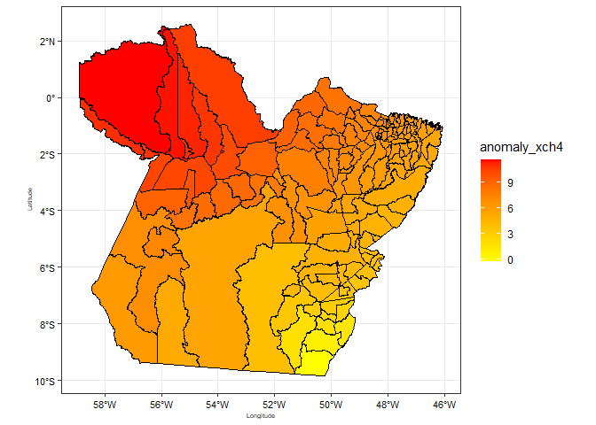<!-- -->

``` r
map(estados[-6],my_plot_map_beta,.variable="beta_sif")
```

    ## [[1]]

<!-- -->

    ## 
    ## [[2]]

<!-- -->

    ## 
    ## [[3]]

<!-- -->

    ## 
    ## [[4]]

<!-- -->

    ## 
    ## [[5]]

<!-- -->

``` r
map(estados[-6],my_plot_map_beta,.variable="anomaly_sif")
```

    ## [[1]]

<!-- -->

    ## 
    ## [[2]]

<!-- -->

    ## 
    ## [[3]]

<!-- -->

    ## 
    ## [[4]]

<!-- -->

    ## 
    ## [[5]]

<!-- --> \#
Incorporação dos dados do CT

## IMPORTANDO A BASE DE DADOS

``` r
brazil_ids <- read_rds("data/df_nome.rds")
nomes_uf <- c(brazil_ids$nome_uf |> unique(),"Brazil")
emissions_sources <- read_rds('data/emissions_sources.rds')
```

``` r
city_kgr_beta_emission <- city_kgr_beta |>
  left_join(
    emissions_sources |>
      filter(year == 2020,                 #%in% 2015:2022
             sigla_uf %in% estados,
             !source_name %in% nomes_uf,
             str_detect(activity_units, 'animal'),
             gas == 'co2e_100yr') |>
      group_by(city_ref, sigla_uf)  |>
      summarise(emissions_quantity =
                  sum(emissions_quantity, na.rm = TRUE)) |>
      rename(abbrev_state = sigla_uf,name_muni =city_ref) |>
      ungroup(),
    by=c("name_muni","abbrev_state")
  )
```

## CARACTERIZANDO MUNICÍPIO

``` r
cities <- citys

# DADOS IBGE:
# Quantidade de Cabeças de MS: 18433728
# Quantidade de Cabeças de MT: 34246313
# Quantidade de Cabeças de MG: 22993105
# Quantidade de Cabeças de GO: 24410182
# Quantidade de Cabeças de PA: 24791060

# Quantidade de municípios de MS: 79
# Quantidade de municípios de MT: 141
# Quantidade de municípios de MG: 853
# Quantidade de municípios de GO: 246
# Quantidade de municípios de PA: 144

estado <- 'GO'
quant_head <- 24410182

emissions_sources |>
  filter(year == 2020,
         str_detect(activity_units, 'animal'),
         # sector_name == 'agriculture',
         !source_name %in% nomes_uf,
         sigla_uf == estado,
         gas == 'co2e_100yr') |>
  group_by(sigla_uf) |>                  #!!
  summarise(
    emission_total = sum(emissions_quantity)/1e6,
    mean_head = sum(emissions_quantity)/quant_head
    ) |>
  arrange(- emission_total)
```

    ## # A tibble: 1 × 3
    ##   sigla_uf emission_total mean_head
    ##   <chr>             <dbl>     <dbl>
    ## 1 GO                 36.8      1.51

## CRIANDO TEMA GRAFICO

``` r
my_theme <- theme(
       # axis.text.x = element_text(size = rel(1.25)),
        axis.title.x = element_text(size = rel(1.4)),
       # axis.text.y = element_text(size = rel(1.3)),
        axis.title.y = element_text(size = rel(1.4)),
        legend.text = element_text(size = rel(0.9)),
       # legend.title = element_text(size = rel(1.7)),
       title = element_text(face = 'bold'),
       legend.position = "top",
       legend.background = element_rect(fill = "#fffff0", color = "black"))

my_theme_add <- function(.my_theme){
 theme(
       # axis.text.x = element_text(size = rel(1.25)),
        axis.title.x = element_text(size = rel(1.4)),
       # axis.text.y = element_text(size = rel(1.3)),
        axis.title.y = element_text(size = rel(1.4)),
        legend.text = element_text(size = rel(0.9)),
       # legend.title = element_text(size = rel(1.7)),
       title = element_text(face = 'bold'),
       legend.position = "top",
       legend.background = element_rect(fill = "transparent", color = "black"))
}
```

## MAPEAR

### CONTRUINDO MAPA COM CLASSES

``` r
#my_state <- "MS" ### <-
my_plot_map <- function(.estados){
  citys |>
  select(abbrev_state) |>
  filter(
    abbrev_state == .estados) |>
  ggplot() +
  geom_sf(fill="white", color="black",
          size=.15, show.legend = F) +
  geom_point(data = emissions_sources |>
               filter(year == 2020, #>2014 & year <2023
                      sigla_uf == .estados,
                      str_detect(activity_units, 'animal'),
                      gas == 'co2e_100yr') |>
               mutate(
                 classe_emissao = case_when(
                   emissions_quantity <0.1e6 ~ '< 0.1 Mton',
                   emissions_quantity <0.4e6 ~ '< 0.4 Mton',
                   emissions_quantity <1e6 ~ '< 1 Mton',
                   emissions_quantity >=1e6 ~ '>= 1 Mton'
                 )
               ),
             size = 1.5,
             aes(lon,lat, col = classe_emissao)) +
    theme_bw() +
  theme(
    axis.text.x = element_text(size = rel(1), color = "#222222"),
    axis.title.x = element_text(size = rel(1.3), color = "#222222"),
    axis.text.y = element_text(size = rel(1), color = "#222222"),
    axis.title.y = element_text(size = rel(1.3), color = "#222222"),
    legend.text = element_text(size = rel(1.3), color = "#222222"),
    legend.title = element_text(size = rel(1.5)),
    ) +
   labs(col = 'CO'[2]~'eq emission',
        x = 'Longitude',
        y = 'Latitude'
     #title = paste0("CO2e emission for", my_state),
        # caption = 'Data Source: Climate TRACE',
     )
}

map(estados,my_plot_map)
```

    ## [[1]]

<!-- -->

    ## 
    ## [[2]]

<!-- -->

    ## 
    ## [[3]]

<!-- -->

    ## 
    ## [[4]]

<!-- -->

    ## 
    ## [[5]]

<!-- -->

    ## 
    ## [[6]]

<!-- -->

``` r
# ggsave('GO.png', dpi = 3000, width = 9, height = 5.5)
```

``` r
# estado <- "MG" ### <-
# estados <- c("MS", "PA", "GO", "MT", "MG")
#
# my_plot_map_join <- function(.estados){
#   left_join(city |> filter(abbrev_state == .estados),
#           emissions_sources |>
#             filter(year == 2020, #>2014 & year <2023
#                    sigla_uf == .estados,
#                    !source_name %in% nomes_uf,
#                    str_detect(activity_units, 'animal'),            #filtering the four subsectors for cattle
#                    gas == 'co2e_100yr') |>
#             group_by(city_ref, sigla_uf)  |>
#             summarise(emissions_quantity =
#                         sum(emissions_quantity, na.rm = TRUE)) |>
#             rename(name_muni = city_ref) ,
#           by="name_muni") |>
#   mutate(emissions_quantity = replace_na(emissions_quantity,0)) |>
#   mutate(
#     classe_emissao = case_when(
#       emissions_quantity <0.1e6 ~ '< 0.1 Mton',
#       emissions_quantity <0.4e6 ~ '< 0.4 Mton',
#       emissions_quantity <0.7e6 ~ '< 0.7 Mton',
#       emissions_quantity >=1 ~ '>= 1 Mton'
#     )
#   ) |>
#     ggplot() +
#     geom_sf(aes(fill=classe_emissao), color="black",
#             size=.15, show.legend = TRUE)  +
#     theme_bw() +
#   theme(
#     axis.text.x = element_text(size = rel(1), color = "#222222"),
#     axis.title.x = element_text(size = rel(1.3), color = "#222222"),
#     axis.text.y = element_text(size = rel(1), color = "#222222"),
#     axis.title.y = element_text(size = rel(1.3), color = "#222222"),
#     legend.text = element_text(size = rel(1.3), color = "#222222"),
#     legend.title = element_text(size = rel(1.5)),
#     ) +
#    labs(fill = 'CO'[2]'e emission',
#         x = 'Longitude',
#         y = 'Latitude'
#      #title = paste0("CO2e emission for", my_state),
#         # caption = 'Data Source: Climate TRACE',
#      ) +
#     scale_fill_viridis_d()
# }
# map(estados,my_plot_map_join)

# ggsave('MGg_col.png', dpi = 2000, width = 9, height = 5.5)


#Gerando os mapas em uma única figura
left_join(citys |> filter(abbrev_state %in% estados),
           emissions_sources |>
             filter(year == 2020,                 #%in% 2015:2022
                    sigla_uf %in% estados,
                    !source_name %in% nomes_uf,
                    str_detect(activity_units, 'animal'),            #filtering the four subsectors for cattle
                    gas == 'co2e_100yr') |>
             group_by(city_ref, sigla_uf)  |>
             summarise(emissions_quantity =
                         sum(emissions_quantity, na.rm = TRUE)) |>
             rename(name_muni = city_ref),
           by="name_muni") |>
   mutate(emissions_quantity = replace_na(emissions_quantity, 0)) |>
   mutate(
     classe_emissao = case_when(
       emissions_quantity <.1e6 ~ ' <  0,1 Mton',
       emissions_quantity <.5e6 ~ ' <  0,5 Mton',
       emissions_quantity < 1e6 ~ ' <  1,0 Mton',
       emissions_quantity >=1e6 ~ '>= 1,0 Mton'
     )
   ) |>
     ggplot() +
     geom_sf(aes(fill=classe_emissao), color="black",
             size=.05, show.legend = TRUE)  +
   geom_sf(data=mapas_contorno1, fill="transparent", color="red", size=3, show.legend = FALSE) +
   geom_sf(data=mapas_contorno2, fill="transparent", color="red", size=3, show.legend = FALSE) +
   geom_sf(data=mapas_contorno3, fill="transparent", color="red", size=3, show.legend = FALSE) +
   geom_sf(data=mapas_contorno4, fill="transparent", color="red", size=3, show.legend = FALSE) +
   geom_sf(data=mapas_contorno5, fill="transparent", color="red", size=3, show.legend = FALSE) +
     theme_bw() +
   theme(
     axis.text.x = element_text(size = rel(.9), color = "black"),
     axis.title.x = element_text(size = rel(1.1), color = "black"),
     axis.text.y = element_text(size = rel(.9), color = "black"),
     axis.title.y = element_text(size = rel(1.1), color = "black"),
     legend.text = element_text(size = rel(1), color = "black"),
     legend.title = element_text(face = 'bold', size = rel(1.2)),
     legend.position = c(1.29, .5)
     ) +
   labs(fill = 'Classe de emissão',
         x = 'Longitude',
         y = 'Latitude') +
     scale_fill_viridis_d()
```

<!-- -->

``` r
 # ggsave('Maps_states_red.png')
 ggsave('mapa_nova_classe.png')
```

## Análise de correlação

``` r
my_corrplot <- function(.estado){
  pl<- city_kgr_beta_emission |>
    as_data_frame() |>
    filter(abbrev_state == .estado) |>
    select(beta_sif:emissions_quantity) |>
    relocate(emissions_quantity) |>
    drop_na() |>
    cor(method = "spearman") |>
    corrplot::corrplot(method = "ellipse",type = "upper" )
  print(pl)
}
map(estados[-6],my_corrplot)
```

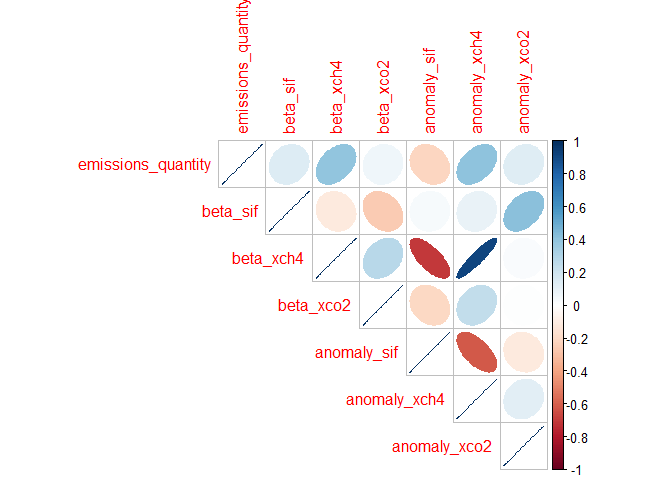<!-- -->

    ## $corr
    ##                    emissions_quantity    beta_sif   beta_xch4    beta_xco2
    ## emissions_quantity         1.00000000  0.14873419  0.39927857  0.068290722
    ## beta_sif                   0.14873419  1.00000000 -0.11432897 -0.259431158
    ## beta_xch4                  0.39927857 -0.11432897  1.00000000  0.275909344
    ## beta_xco2                  0.06829072 -0.25943116  0.27590934  1.000000000
    ## anomaly_sif               -0.21316383  0.03236850 -0.70127669 -0.204801774
    ## anomaly_xch4               0.40842013  0.09156827  0.91415516  0.245724009
    ## anomaly_xco2               0.13781510  0.41136493  0.02038552  0.004086857
    ##                    anomaly_sif anomaly_xch4 anomaly_xco2
    ## emissions_quantity  -0.2131638   0.40842013  0.137815098
    ## beta_sif             0.0323685   0.09156827  0.411364933
    ## beta_xch4           -0.7012767   0.91415516  0.020385523
    ## beta_xco2           -0.2048018   0.24572401  0.004086857
    ## anomaly_sif          1.0000000  -0.61527589 -0.110828208
    ## anomaly_xch4        -0.6152759   1.00000000  0.128256899
    ## anomaly_xco2        -0.1108282   0.12825690  1.000000000
    ## 
    ## $corrPos
    ##                 xName              yName x y         corr
    ## 1  emissions_quantity emissions_quantity 1 7  1.000000000
    ## 2            beta_sif emissions_quantity 2 7  0.148734193
    ## 3            beta_sif           beta_sif 2 6  1.000000000
    ## 4           beta_xch4 emissions_quantity 3 7  0.399278574
    ## 5           beta_xch4           beta_sif 3 6 -0.114328968
    ## 6           beta_xch4          beta_xch4 3 5  1.000000000
    ## 7           beta_xco2 emissions_quantity 4 7  0.068290722
    ## 8           beta_xco2           beta_sif 4 6 -0.259431158
    ## 9           beta_xco2          beta_xch4 4 5  0.275909344
    ## 10          beta_xco2          beta_xco2 4 4  1.000000000
    ## 11        anomaly_sif emissions_quantity 5 7 -0.213163832
    ## 12        anomaly_sif           beta_sif 5 6  0.032368505
    ## 13        anomaly_sif          beta_xch4 5 5 -0.701276686
    ## 14        anomaly_sif          beta_xco2 5 4 -0.204801774
    ## 15        anomaly_sif        anomaly_sif 5 3  1.000000000
    ## 16       anomaly_xch4 emissions_quantity 6 7  0.408420128
    ## 17       anomaly_xch4           beta_sif 6 6  0.091568266
    ## 18       anomaly_xch4          beta_xch4 6 5  0.914155157
    ## 19       anomaly_xch4          beta_xco2 6 4  0.245724009
    ## 20       anomaly_xch4        anomaly_sif 6 3 -0.615275894
    ## 21       anomaly_xch4       anomaly_xch4 6 2  1.000000000
    ## 22       anomaly_xco2 emissions_quantity 7 7  0.137815098
    ## 23       anomaly_xco2           beta_sif 7 6  0.411364933
    ## 24       anomaly_xco2          beta_xch4 7 5  0.020385523
    ## 25       anomaly_xco2          beta_xco2 7 4  0.004086857
    ## 26       anomaly_xco2        anomaly_sif 7 3 -0.110828208
    ## 27       anomaly_xco2       anomaly_xch4 7 2  0.128256899
    ## 28       anomaly_xco2       anomaly_xco2 7 1  1.000000000
    ## 
    ## $arg
    ## $arg$type
    ## [1] "upper"

<!-- -->

    ## $corr
    ##                    emissions_quantity   beta_sif   beta_xch4   beta_xco2
    ## emissions_quantity         1.00000000 -0.1059981 -0.12023791 -0.07830137
    ## beta_sif                  -0.10599812  1.0000000 -0.80013120  0.17542586
    ## beta_xch4                 -0.12023791 -0.8001312  1.00000000 -0.17087315
    ## beta_xco2                 -0.07830137  0.1754259 -0.17087315  1.00000000
    ## anomaly_sif               -0.26958081 -0.3436575  0.55370755  0.02117601
    ## anomaly_xch4              -0.34435285  0.4305263 -0.01053552  0.10596751
    ## anomaly_xco2              -0.20314448 -0.3211388  0.38388402  0.08627408
    ##                    anomaly_sif anomaly_xch4 anomaly_xco2
    ## emissions_quantity -0.26958081  -0.34435285  -0.20314448
    ## beta_sif           -0.34365748   0.43052634  -0.32113883
    ## beta_xch4           0.55370755  -0.01053552   0.38388402
    ## beta_xco2           0.02117601   0.10596751   0.08627408
    ## anomaly_sif         1.00000000   0.50385078   0.54381054
    ## anomaly_xch4        0.50385078   1.00000000   0.27173252
    ## anomaly_xco2        0.54381054   0.27173252   1.00000000
    ## 
    ## $corrPos
    ##                 xName              yName x y        corr
    ## 1  emissions_quantity emissions_quantity 1 7  1.00000000
    ## 2            beta_sif emissions_quantity 2 7 -0.10599812
    ## 3            beta_sif           beta_sif 2 6  1.00000000
    ## 4           beta_xch4 emissions_quantity 3 7 -0.12023791
    ## 5           beta_xch4           beta_sif 3 6 -0.80013120
    ## 6           beta_xch4          beta_xch4 3 5  1.00000000
    ## 7           beta_xco2 emissions_quantity 4 7 -0.07830137
    ## 8           beta_xco2           beta_sif 4 6  0.17542586
    ## 9           beta_xco2          beta_xch4 4 5 -0.17087315
    ## 10          beta_xco2          beta_xco2 4 4  1.00000000
    ## 11        anomaly_sif emissions_quantity 5 7 -0.26958081
    ## 12        anomaly_sif           beta_sif 5 6 -0.34365748
    ## 13        anomaly_sif          beta_xch4 5 5  0.55370755
    ## 14        anomaly_sif          beta_xco2 5 4  0.02117601
    ## 15        anomaly_sif        anomaly_sif 5 3  1.00000000
    ## 16       anomaly_xch4 emissions_quantity 6 7 -0.34435285
    ## 17       anomaly_xch4           beta_sif 6 6  0.43052634
    ## 18       anomaly_xch4          beta_xch4 6 5 -0.01053552
    ## 19       anomaly_xch4          beta_xco2 6 4  0.10596751
    ## 20       anomaly_xch4        anomaly_sif 6 3  0.50385078
    ## 21       anomaly_xch4       anomaly_xch4 6 2  1.00000000
    ## 22       anomaly_xco2 emissions_quantity 7 7 -0.20314448
    ## 23       anomaly_xco2           beta_sif 7 6 -0.32113883
    ## 24       anomaly_xco2          beta_xch4 7 5  0.38388402
    ## 25       anomaly_xco2          beta_xco2 7 4  0.08627408
    ## 26       anomaly_xco2        anomaly_sif 7 3  0.54381054
    ## 27       anomaly_xco2       anomaly_xch4 7 2  0.27173252
    ## 28       anomaly_xco2       anomaly_xco2 7 1  1.00000000
    ## 
    ## $arg
    ## $arg$type
    ## [1] "upper"

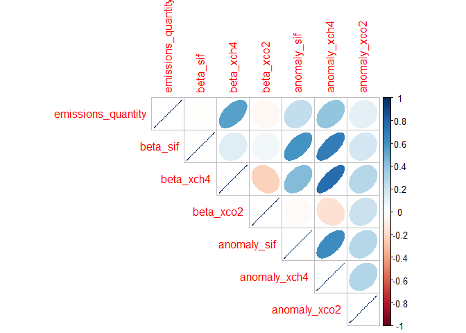<!-- -->

    ## $corr
    ##                    emissions_quantity    beta_sif  beta_xch4   beta_xco2
    ## emissions_quantity         1.00000000 -0.00418003  0.5457437 -0.03564856
    ## beta_sif                  -0.00418003  1.00000000  0.1314738  0.05008150
    ## beta_xch4                  0.54574373  0.13147379  1.0000000 -0.22385509
    ## beta_xco2                 -0.03564856  0.05008150 -0.2238551  1.00000000
    ## anomaly_sif                0.24670067  0.59790210  0.4392975 -0.02663126
    ## anomaly_xch4               0.39602503  0.69874862  0.7656554 -0.15642252
    ## anomaly_xco2               0.11175666  0.18999422  0.2883958  0.21964877
    ##                    anomaly_sif anomaly_xch4 anomaly_xco2
    ## emissions_quantity  0.24670067    0.3960250    0.1117567
    ## beta_sif            0.59790210    0.6987486    0.1899942
    ## beta_xch4           0.43929754    0.7656554    0.2883958
    ## beta_xco2          -0.02663126   -0.1564225    0.2196488
    ## anomaly_sif         1.00000000    0.6230874    0.2892897
    ## anomaly_xch4        0.62308744    1.0000000    0.2950208
    ## anomaly_xco2        0.28928966    0.2950208    1.0000000
    ## 
    ## $corrPos
    ##                 xName              yName x y        corr
    ## 1  emissions_quantity emissions_quantity 1 7  1.00000000
    ## 2            beta_sif emissions_quantity 2 7 -0.00418003
    ## 3            beta_sif           beta_sif 2 6  1.00000000
    ## 4           beta_xch4 emissions_quantity 3 7  0.54574373
    ## 5           beta_xch4           beta_sif 3 6  0.13147379
    ## 6           beta_xch4          beta_xch4 3 5  1.00000000
    ## 7           beta_xco2 emissions_quantity 4 7 -0.03564856
    ## 8           beta_xco2           beta_sif 4 6  0.05008150
    ## 9           beta_xco2          beta_xch4 4 5 -0.22385509
    ## 10          beta_xco2          beta_xco2 4 4  1.00000000
    ## 11        anomaly_sif emissions_quantity 5 7  0.24670067
    ## 12        anomaly_sif           beta_sif 5 6  0.59790210
    ## 13        anomaly_sif          beta_xch4 5 5  0.43929754
    ## 14        anomaly_sif          beta_xco2 5 4 -0.02663126
    ## 15        anomaly_sif        anomaly_sif 5 3  1.00000000
    ## 16       anomaly_xch4 emissions_quantity 6 7  0.39602503
    ## 17       anomaly_xch4           beta_sif 6 6  0.69874862
    ## 18       anomaly_xch4          beta_xch4 6 5  0.76565540
    ## 19       anomaly_xch4          beta_xco2 6 4 -0.15642252
    ## 20       anomaly_xch4        anomaly_sif 6 3  0.62308744
    ## 21       anomaly_xch4       anomaly_xch4 6 2  1.00000000
    ## 22       anomaly_xco2 emissions_quantity 7 7  0.11175666
    ## 23       anomaly_xco2           beta_sif 7 6  0.18999422
    ## 24       anomaly_xco2          beta_xch4 7 5  0.28839581
    ## 25       anomaly_xco2          beta_xco2 7 4  0.21964877
    ## 26       anomaly_xco2        anomaly_sif 7 3  0.28928966
    ## 27       anomaly_xco2       anomaly_xch4 7 2  0.29502077
    ## 28       anomaly_xco2       anomaly_xco2 7 1  1.00000000
    ## 
    ## $arg
    ## $arg$type
    ## [1] "upper"

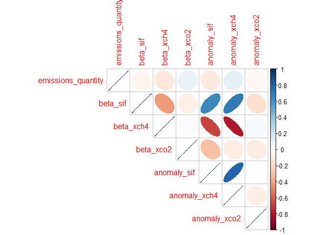<!-- -->

    ## $corr
    ##                    emissions_quantity    beta_sif   beta_xch4   beta_xco2
    ## emissions_quantity         1.00000000 -0.05849422 -0.12600991  0.09689740
    ## beta_sif                  -0.05849422  1.00000000 -0.42050427 -0.08048078
    ## beta_xch4                 -0.12600991 -0.42050427  1.00000000  0.02264240
    ## beta_xco2                  0.09689740 -0.08048078  0.02264240  1.00000000
    ## anomaly_sif               -0.11157539  0.64254655 -0.67505830 -0.29220020
    ## anomaly_xch4               0.10015003  0.70808443 -0.79811821 -0.09327184
    ## anomaly_xco2              -0.04661620 -0.16445252  0.03729039 -0.10029749
    ##                     anomaly_sif anomaly_xch4 anomaly_xco2
    ## emissions_quantity -0.111575392   0.10015003 -0.046616200
    ## beta_sif            0.642546552   0.70808443 -0.164452522
    ## beta_xch4          -0.675058297  -0.79811821  0.037290388
    ## beta_xco2          -0.292200199  -0.09327184 -0.100297486
    ## anomaly_sif         1.000000000   0.79324697  0.009159494
    ## anomaly_xch4        0.793246974   1.00000000 -0.094803848
    ## anomaly_xco2        0.009159494  -0.09480385  1.000000000
    ## 
    ## $corrPos
    ##                 xName              yName x y         corr
    ## 1  emissions_quantity emissions_quantity 1 7  1.000000000
    ## 2            beta_sif emissions_quantity 2 7 -0.058494222
    ## 3            beta_sif           beta_sif 2 6  1.000000000
    ## 4           beta_xch4 emissions_quantity 3 7 -0.126009910
    ## 5           beta_xch4           beta_sif 3 6 -0.420504269
    ## 6           beta_xch4          beta_xch4 3 5  1.000000000
    ## 7           beta_xco2 emissions_quantity 4 7  0.096897397
    ## 8           beta_xco2           beta_sif 4 6 -0.080480779
    ## 9           beta_xco2          beta_xch4 4 5  0.022642399
    ## 10          beta_xco2          beta_xco2 4 4  1.000000000
    ## 11        anomaly_sif emissions_quantity 5 7 -0.111575392
    ## 12        anomaly_sif           beta_sif 5 6  0.642546552
    ## 13        anomaly_sif          beta_xch4 5 5 -0.675058297
    ## 14        anomaly_sif          beta_xco2 5 4 -0.292200199
    ## 15        anomaly_sif        anomaly_sif 5 3  1.000000000
    ## 16       anomaly_xch4 emissions_quantity 6 7  0.100150029
    ## 17       anomaly_xch4           beta_sif 6 6  0.708084428
    ## 18       anomaly_xch4          beta_xch4 6 5 -0.798118206
    ## 19       anomaly_xch4          beta_xco2 6 4 -0.093271836
    ## 20       anomaly_xch4        anomaly_sif 6 3  0.793246974
    ## 21       anomaly_xch4       anomaly_xch4 6 2  1.000000000
    ## 22       anomaly_xco2 emissions_quantity 7 7 -0.046616200
    ## 23       anomaly_xco2           beta_sif 7 6 -0.164452522
    ## 24       anomaly_xco2          beta_xch4 7 5  0.037290388
    ## 25       anomaly_xco2          beta_xco2 7 4 -0.100297486
    ## 26       anomaly_xco2        anomaly_sif 7 3  0.009159494
    ## 27       anomaly_xco2       anomaly_xch4 7 2 -0.094803848
    ## 28       anomaly_xco2       anomaly_xco2 7 1  1.000000000
    ## 
    ## $arg
    ## $arg$type
    ## [1] "upper"

<!-- -->

    ## $corr
    ##                    emissions_quantity    beta_sif   beta_xch4    beta_xco2
    ## emissions_quantity          1.0000000 0.174825175  0.43807406 -0.245656351
    ## beta_sif                    0.1748252 1.000000000  0.55199071  0.009474194
    ## beta_xch4                   0.4380741 0.551990712  1.00000000 -0.256343896
    ## beta_xco2                  -0.2456564 0.009474194 -0.25634390  1.000000000
    ## anomaly_sif                 0.3122418 0.298641425  0.71157042 -0.117422583
    ## anomaly_xch4               -0.3906256 0.057295716  0.03364481  0.074907113
    ## anomaly_xco2                0.2805648 0.246528120  0.26273128  0.034902167
    ##                    anomaly_sif anomaly_xch4 anomaly_xco2
    ## emissions_quantity   0.3122418  -0.39062556   0.28056481
    ## beta_sif             0.2986414   0.05729572   0.24652812
    ## beta_xch4            0.7115704   0.03364481   0.26273128
    ## beta_xco2           -0.1174226   0.07490711   0.03490217
    ## anomaly_sif          1.0000000   0.18786398   0.41602419
    ## anomaly_xch4         0.1878640   1.00000000   0.11316433
    ## anomaly_xco2         0.4160242   0.11316433   1.00000000
    ## 
    ## $corrPos
    ##                 xName              yName x y         corr
    ## 1  emissions_quantity emissions_quantity 1 7  1.000000000
    ## 2            beta_sif emissions_quantity 2 7  0.174825175
    ## 3            beta_sif           beta_sif 2 6  1.000000000
    ## 4           beta_xch4 emissions_quantity 3 7  0.438074063
    ## 5           beta_xch4           beta_sif 3 6  0.551990712
    ## 6           beta_xch4          beta_xch4 3 5  1.000000000
    ## 7           beta_xco2 emissions_quantity 4 7 -0.245656351
    ## 8           beta_xco2           beta_sif 4 6  0.009474194
    ## 9           beta_xco2          beta_xch4 4 5 -0.256343896
    ## 10          beta_xco2          beta_xco2 4 4  1.000000000
    ## 11        anomaly_sif emissions_quantity 5 7  0.312241849
    ## 12        anomaly_sif           beta_sif 5 6  0.298641425
    ## 13        anomaly_sif          beta_xch4 5 5  0.711570419
    ## 14        anomaly_sif          beta_xco2 5 4 -0.117422583
    ## 15        anomaly_sif        anomaly_sif 5 3  1.000000000
    ## 16       anomaly_xch4 emissions_quantity 6 7 -0.390625557
    ## 17       anomaly_xch4           beta_sif 6 6  0.057295716
    ## 18       anomaly_xch4          beta_xch4 6 5  0.033644809
    ## 19       anomaly_xch4          beta_xco2 6 4  0.074907113
    ## 20       anomaly_xch4        anomaly_sif 6 3  0.187863979
    ## 21       anomaly_xch4       anomaly_xch4 6 2  1.000000000
    ## 22       anomaly_xco2 emissions_quantity 7 7  0.280564805
    ## 23       anomaly_xco2           beta_sif 7 6  0.246528120
    ## 24       anomaly_xco2          beta_xch4 7 5  0.262731275
    ## 25       anomaly_xco2          beta_xco2 7 4  0.034902167
    ## 26       anomaly_xco2        anomaly_sif 7 3  0.416024192
    ## 27       anomaly_xco2       anomaly_xch4 7 2  0.113164330
    ## 28       anomaly_xco2       anomaly_xco2 7 1  1.000000000
    ## 
    ## $arg
    ## $arg$type
    ## [1] "upper"

    ## [[1]]
    ## [[1]]$corr
    ##                    emissions_quantity    beta_sif   beta_xch4    beta_xco2
    ## emissions_quantity         1.00000000  0.14873419  0.39927857  0.068290722
    ## beta_sif                   0.14873419  1.00000000 -0.11432897 -0.259431158
    ## beta_xch4                  0.39927857 -0.11432897  1.00000000  0.275909344
    ## beta_xco2                  0.06829072 -0.25943116  0.27590934  1.000000000
    ## anomaly_sif               -0.21316383  0.03236850 -0.70127669 -0.204801774
    ## anomaly_xch4               0.40842013  0.09156827  0.91415516  0.245724009
    ## anomaly_xco2               0.13781510  0.41136493  0.02038552  0.004086857
    ##                    anomaly_sif anomaly_xch4 anomaly_xco2
    ## emissions_quantity  -0.2131638   0.40842013  0.137815098
    ## beta_sif             0.0323685   0.09156827  0.411364933
    ## beta_xch4           -0.7012767   0.91415516  0.020385523
    ## beta_xco2           -0.2048018   0.24572401  0.004086857
    ## anomaly_sif          1.0000000  -0.61527589 -0.110828208
    ## anomaly_xch4        -0.6152759   1.00000000  0.128256899
    ## anomaly_xco2        -0.1108282   0.12825690  1.000000000
    ## 
    ## [[1]]$corrPos
    ##                 xName              yName x y         corr
    ## 1  emissions_quantity emissions_quantity 1 7  1.000000000
    ## 2            beta_sif emissions_quantity 2 7  0.148734193
    ## 3            beta_sif           beta_sif 2 6  1.000000000
    ## 4           beta_xch4 emissions_quantity 3 7  0.399278574
    ## 5           beta_xch4           beta_sif 3 6 -0.114328968
    ## 6           beta_xch4          beta_xch4 3 5  1.000000000
    ## 7           beta_xco2 emissions_quantity 4 7  0.068290722
    ## 8           beta_xco2           beta_sif 4 6 -0.259431158
    ## 9           beta_xco2          beta_xch4 4 5  0.275909344
    ## 10          beta_xco2          beta_xco2 4 4  1.000000000
    ## 11        anomaly_sif emissions_quantity 5 7 -0.213163832
    ## 12        anomaly_sif           beta_sif 5 6  0.032368505
    ## 13        anomaly_sif          beta_xch4 5 5 -0.701276686
    ## 14        anomaly_sif          beta_xco2 5 4 -0.204801774
    ## 15        anomaly_sif        anomaly_sif 5 3  1.000000000
    ## 16       anomaly_xch4 emissions_quantity 6 7  0.408420128
    ## 17       anomaly_xch4           beta_sif 6 6  0.091568266
    ## 18       anomaly_xch4          beta_xch4 6 5  0.914155157
    ## 19       anomaly_xch4          beta_xco2 6 4  0.245724009
    ## 20       anomaly_xch4        anomaly_sif 6 3 -0.615275894
    ## 21       anomaly_xch4       anomaly_xch4 6 2  1.000000000
    ## 22       anomaly_xco2 emissions_quantity 7 7  0.137815098
    ## 23       anomaly_xco2           beta_sif 7 6  0.411364933
    ## 24       anomaly_xco2          beta_xch4 7 5  0.020385523
    ## 25       anomaly_xco2          beta_xco2 7 4  0.004086857
    ## 26       anomaly_xco2        anomaly_sif 7 3 -0.110828208
    ## 27       anomaly_xco2       anomaly_xch4 7 2  0.128256899
    ## 28       anomaly_xco2       anomaly_xco2 7 1  1.000000000
    ## 
    ## [[1]]$arg
    ## [[1]]$arg$type
    ## [1] "upper"
    ## 
    ## 
    ## 
    ## [[2]]
    ## [[2]]$corr
    ##                    emissions_quantity   beta_sif   beta_xch4   beta_xco2
    ## emissions_quantity         1.00000000 -0.1059981 -0.12023791 -0.07830137
    ## beta_sif                  -0.10599812  1.0000000 -0.80013120  0.17542586
    ## beta_xch4                 -0.12023791 -0.8001312  1.00000000 -0.17087315
    ## beta_xco2                 -0.07830137  0.1754259 -0.17087315  1.00000000
    ## anomaly_sif               -0.26958081 -0.3436575  0.55370755  0.02117601
    ## anomaly_xch4              -0.34435285  0.4305263 -0.01053552  0.10596751
    ## anomaly_xco2              -0.20314448 -0.3211388  0.38388402  0.08627408
    ##                    anomaly_sif anomaly_xch4 anomaly_xco2
    ## emissions_quantity -0.26958081  -0.34435285  -0.20314448
    ## beta_sif           -0.34365748   0.43052634  -0.32113883
    ## beta_xch4           0.55370755  -0.01053552   0.38388402
    ## beta_xco2           0.02117601   0.10596751   0.08627408
    ## anomaly_sif         1.00000000   0.50385078   0.54381054
    ## anomaly_xch4        0.50385078   1.00000000   0.27173252
    ## anomaly_xco2        0.54381054   0.27173252   1.00000000
    ## 
    ## [[2]]$corrPos
    ##                 xName              yName x y        corr
    ## 1  emissions_quantity emissions_quantity 1 7  1.00000000
    ## 2            beta_sif emissions_quantity 2 7 -0.10599812
    ## 3            beta_sif           beta_sif 2 6  1.00000000
    ## 4           beta_xch4 emissions_quantity 3 7 -0.12023791
    ## 5           beta_xch4           beta_sif 3 6 -0.80013120
    ## 6           beta_xch4          beta_xch4 3 5  1.00000000
    ## 7           beta_xco2 emissions_quantity 4 7 -0.07830137
    ## 8           beta_xco2           beta_sif 4 6  0.17542586
    ## 9           beta_xco2          beta_xch4 4 5 -0.17087315
    ## 10          beta_xco2          beta_xco2 4 4  1.00000000
    ## 11        anomaly_sif emissions_quantity 5 7 -0.26958081
    ## 12        anomaly_sif           beta_sif 5 6 -0.34365748
    ## 13        anomaly_sif          beta_xch4 5 5  0.55370755
    ## 14        anomaly_sif          beta_xco2 5 4  0.02117601
    ## 15        anomaly_sif        anomaly_sif 5 3  1.00000000
    ## 16       anomaly_xch4 emissions_quantity 6 7 -0.34435285
    ## 17       anomaly_xch4           beta_sif 6 6  0.43052634
    ## 18       anomaly_xch4          beta_xch4 6 5 -0.01053552
    ## 19       anomaly_xch4          beta_xco2 6 4  0.10596751
    ## 20       anomaly_xch4        anomaly_sif 6 3  0.50385078
    ## 21       anomaly_xch4       anomaly_xch4 6 2  1.00000000
    ## 22       anomaly_xco2 emissions_quantity 7 7 -0.20314448
    ## 23       anomaly_xco2           beta_sif 7 6 -0.32113883
    ## 24       anomaly_xco2          beta_xch4 7 5  0.38388402
    ## 25       anomaly_xco2          beta_xco2 7 4  0.08627408
    ## 26       anomaly_xco2        anomaly_sif 7 3  0.54381054
    ## 27       anomaly_xco2       anomaly_xch4 7 2  0.27173252
    ## 28       anomaly_xco2       anomaly_xco2 7 1  1.00000000
    ## 
    ## [[2]]$arg
    ## [[2]]$arg$type
    ## [1] "upper"
    ## 
    ## 
    ## 
    ## [[3]]
    ## [[3]]$corr
    ##                    emissions_quantity    beta_sif  beta_xch4   beta_xco2
    ## emissions_quantity         1.00000000 -0.00418003  0.5457437 -0.03564856
    ## beta_sif                  -0.00418003  1.00000000  0.1314738  0.05008150
    ## beta_xch4                  0.54574373  0.13147379  1.0000000 -0.22385509
    ## beta_xco2                 -0.03564856  0.05008150 -0.2238551  1.00000000
    ## anomaly_sif                0.24670067  0.59790210  0.4392975 -0.02663126
    ## anomaly_xch4               0.39602503  0.69874862  0.7656554 -0.15642252
    ## anomaly_xco2               0.11175666  0.18999422  0.2883958  0.21964877
    ##                    anomaly_sif anomaly_xch4 anomaly_xco2
    ## emissions_quantity  0.24670067    0.3960250    0.1117567
    ## beta_sif            0.59790210    0.6987486    0.1899942
    ## beta_xch4           0.43929754    0.7656554    0.2883958
    ## beta_xco2          -0.02663126   -0.1564225    0.2196488
    ## anomaly_sif         1.00000000    0.6230874    0.2892897
    ## anomaly_xch4        0.62308744    1.0000000    0.2950208
    ## anomaly_xco2        0.28928966    0.2950208    1.0000000
    ## 
    ## [[3]]$corrPos
    ##                 xName              yName x y        corr
    ## 1  emissions_quantity emissions_quantity 1 7  1.00000000
    ## 2            beta_sif emissions_quantity 2 7 -0.00418003
    ## 3            beta_sif           beta_sif 2 6  1.00000000
    ## 4           beta_xch4 emissions_quantity 3 7  0.54574373
    ## 5           beta_xch4           beta_sif 3 6  0.13147379
    ## 6           beta_xch4          beta_xch4 3 5  1.00000000
    ## 7           beta_xco2 emissions_quantity 4 7 -0.03564856
    ## 8           beta_xco2           beta_sif 4 6  0.05008150
    ## 9           beta_xco2          beta_xch4 4 5 -0.22385509
    ## 10          beta_xco2          beta_xco2 4 4  1.00000000
    ## 11        anomaly_sif emissions_quantity 5 7  0.24670067
    ## 12        anomaly_sif           beta_sif 5 6  0.59790210
    ## 13        anomaly_sif          beta_xch4 5 5  0.43929754
    ## 14        anomaly_sif          beta_xco2 5 4 -0.02663126
    ## 15        anomaly_sif        anomaly_sif 5 3  1.00000000
    ## 16       anomaly_xch4 emissions_quantity 6 7  0.39602503
    ## 17       anomaly_xch4           beta_sif 6 6  0.69874862
    ## 18       anomaly_xch4          beta_xch4 6 5  0.76565540
    ## 19       anomaly_xch4          beta_xco2 6 4 -0.15642252
    ## 20       anomaly_xch4        anomaly_sif 6 3  0.62308744
    ## 21       anomaly_xch4       anomaly_xch4 6 2  1.00000000
    ## 22       anomaly_xco2 emissions_quantity 7 7  0.11175666
    ## 23       anomaly_xco2           beta_sif 7 6  0.18999422
    ## 24       anomaly_xco2          beta_xch4 7 5  0.28839581
    ## 25       anomaly_xco2          beta_xco2 7 4  0.21964877
    ## 26       anomaly_xco2        anomaly_sif 7 3  0.28928966
    ## 27       anomaly_xco2       anomaly_xch4 7 2  0.29502077
    ## 28       anomaly_xco2       anomaly_xco2 7 1  1.00000000
    ## 
    ## [[3]]$arg
    ## [[3]]$arg$type
    ## [1] "upper"
    ## 
    ## 
    ## 
    ## [[4]]
    ## [[4]]$corr
    ##                    emissions_quantity    beta_sif   beta_xch4   beta_xco2
    ## emissions_quantity         1.00000000 -0.05849422 -0.12600991  0.09689740
    ## beta_sif                  -0.05849422  1.00000000 -0.42050427 -0.08048078
    ## beta_xch4                 -0.12600991 -0.42050427  1.00000000  0.02264240
    ## beta_xco2                  0.09689740 -0.08048078  0.02264240  1.00000000
    ## anomaly_sif               -0.11157539  0.64254655 -0.67505830 -0.29220020
    ## anomaly_xch4               0.10015003  0.70808443 -0.79811821 -0.09327184
    ## anomaly_xco2              -0.04661620 -0.16445252  0.03729039 -0.10029749
    ##                     anomaly_sif anomaly_xch4 anomaly_xco2
    ## emissions_quantity -0.111575392   0.10015003 -0.046616200
    ## beta_sif            0.642546552   0.70808443 -0.164452522
    ## beta_xch4          -0.675058297  -0.79811821  0.037290388
    ## beta_xco2          -0.292200199  -0.09327184 -0.100297486
    ## anomaly_sif         1.000000000   0.79324697  0.009159494
    ## anomaly_xch4        0.793246974   1.00000000 -0.094803848
    ## anomaly_xco2        0.009159494  -0.09480385  1.000000000
    ## 
    ## [[4]]$corrPos
    ##                 xName              yName x y         corr
    ## 1  emissions_quantity emissions_quantity 1 7  1.000000000
    ## 2            beta_sif emissions_quantity 2 7 -0.058494222
    ## 3            beta_sif           beta_sif 2 6  1.000000000
    ## 4           beta_xch4 emissions_quantity 3 7 -0.126009910
    ## 5           beta_xch4           beta_sif 3 6 -0.420504269
    ## 6           beta_xch4          beta_xch4 3 5  1.000000000
    ## 7           beta_xco2 emissions_quantity 4 7  0.096897397
    ## 8           beta_xco2           beta_sif 4 6 -0.080480779
    ## 9           beta_xco2          beta_xch4 4 5  0.022642399
    ## 10          beta_xco2          beta_xco2 4 4  1.000000000
    ## 11        anomaly_sif emissions_quantity 5 7 -0.111575392
    ## 12        anomaly_sif           beta_sif 5 6  0.642546552
    ## 13        anomaly_sif          beta_xch4 5 5 -0.675058297
    ## 14        anomaly_sif          beta_xco2 5 4 -0.292200199
    ## 15        anomaly_sif        anomaly_sif 5 3  1.000000000
    ## 16       anomaly_xch4 emissions_quantity 6 7  0.100150029
    ## 17       anomaly_xch4           beta_sif 6 6  0.708084428
    ## 18       anomaly_xch4          beta_xch4 6 5 -0.798118206
    ## 19       anomaly_xch4          beta_xco2 6 4 -0.093271836
    ## 20       anomaly_xch4        anomaly_sif 6 3  0.793246974
    ## 21       anomaly_xch4       anomaly_xch4 6 2  1.000000000
    ## 22       anomaly_xco2 emissions_quantity 7 7 -0.046616200
    ## 23       anomaly_xco2           beta_sif 7 6 -0.164452522
    ## 24       anomaly_xco2          beta_xch4 7 5  0.037290388
    ## 25       anomaly_xco2          beta_xco2 7 4 -0.100297486
    ## 26       anomaly_xco2        anomaly_sif 7 3  0.009159494
    ## 27       anomaly_xco2       anomaly_xch4 7 2 -0.094803848
    ## 28       anomaly_xco2       anomaly_xco2 7 1  1.000000000
    ## 
    ## [[4]]$arg
    ## [[4]]$arg$type
    ## [1] "upper"
    ## 
    ## 
    ## 
    ## [[5]]
    ## [[5]]$corr
    ##                    emissions_quantity    beta_sif   beta_xch4    beta_xco2
    ## emissions_quantity          1.0000000 0.174825175  0.43807406 -0.245656351
    ## beta_sif                    0.1748252 1.000000000  0.55199071  0.009474194
    ## beta_xch4                   0.4380741 0.551990712  1.00000000 -0.256343896
    ## beta_xco2                  -0.2456564 0.009474194 -0.25634390  1.000000000
    ## anomaly_sif                 0.3122418 0.298641425  0.71157042 -0.117422583
    ## anomaly_xch4               -0.3906256 0.057295716  0.03364481  0.074907113
    ## anomaly_xco2                0.2805648 0.246528120  0.26273128  0.034902167
    ##                    anomaly_sif anomaly_xch4 anomaly_xco2
    ## emissions_quantity   0.3122418  -0.39062556   0.28056481
    ## beta_sif             0.2986414   0.05729572   0.24652812
    ## beta_xch4            0.7115704   0.03364481   0.26273128
    ## beta_xco2           -0.1174226   0.07490711   0.03490217
    ## anomaly_sif          1.0000000   0.18786398   0.41602419
    ## anomaly_xch4         0.1878640   1.00000000   0.11316433
    ## anomaly_xco2         0.4160242   0.11316433   1.00000000
    ## 
    ## [[5]]$corrPos
    ##                 xName              yName x y         corr
    ## 1  emissions_quantity emissions_quantity 1 7  1.000000000
    ## 2            beta_sif emissions_quantity 2 7  0.174825175
    ## 3            beta_sif           beta_sif 2 6  1.000000000
    ## 4           beta_xch4 emissions_quantity 3 7  0.438074063
    ## 5           beta_xch4           beta_sif 3 6  0.551990712
    ## 6           beta_xch4          beta_xch4 3 5  1.000000000
    ## 7           beta_xco2 emissions_quantity 4 7 -0.245656351
    ## 8           beta_xco2           beta_sif 4 6  0.009474194
    ## 9           beta_xco2          beta_xch4 4 5 -0.256343896
    ## 10          beta_xco2          beta_xco2 4 4  1.000000000
    ## 11        anomaly_sif emissions_quantity 5 7  0.312241849
    ## 12        anomaly_sif           beta_sif 5 6  0.298641425
    ## 13        anomaly_sif          beta_xch4 5 5  0.711570419
    ## 14        anomaly_sif          beta_xco2 5 4 -0.117422583
    ## 15        anomaly_sif        anomaly_sif 5 3  1.000000000
    ## 16       anomaly_xch4 emissions_quantity 6 7 -0.390625557
    ## 17       anomaly_xch4           beta_sif 6 6  0.057295716
    ## 18       anomaly_xch4          beta_xch4 6 5  0.033644809
    ## 19       anomaly_xch4          beta_xco2 6 4  0.074907113
    ## 20       anomaly_xch4        anomaly_sif 6 3  0.187863979
    ## 21       anomaly_xch4       anomaly_xch4 6 2  1.000000000
    ## 22       anomaly_xco2 emissions_quantity 7 7  0.280564805
    ## 23       anomaly_xco2           beta_sif 7 6  0.246528120
    ## 24       anomaly_xco2          beta_xch4 7 5  0.262731275
    ## 25       anomaly_xco2          beta_xco2 7 4  0.034902167
    ## 26       anomaly_xco2        anomaly_sif 7 3  0.416024192
    ## 27       anomaly_xco2       anomaly_xch4 7 2  0.113164330
    ## 28       anomaly_xco2       anomaly_xco2 7 1  1.000000000
    ## 
    ## [[5]]$arg
    ## [[5]]$arg$type
    ## [1] "upper"

``` r
mf <- matrix(ncol = 6)
for(i in seq_along(estados[-6])){
  df <- city_kgr_beta_emission |>
    as_data_frame() |>
    filter(abbrev_state == estados[i]) |>
    select(beta_sif:emissions_quantity) |>
    relocate(emissions_quantity) |>
    drop_na()
  m_aux <-cor(df[1],df[2:7],method = "spearman")
  rownames(m_aux) <- paste0(estados[i],"-",rownames(m_aux))
  if(i==1) {
    mf<-m_aux
  }else{
    mf<-rbind(mf,m_aux)
  }
}
corrplot::corrplot(mf, method = "ellipse")
```

<!-- -->

### Verificando maiores cidades emissoras

``` r
# Only for analysis

emissions_sources |>
  #glimpse() |>
  #select(sigla_uf, emissions_quantity, city_ref, gas, activity_units, sector_name, sub_sector) |>
  filter(sigla_uf == "PA",
         gas == 'co2e_100yr',
         year == 2015,
         sector_name == 'agriculture',
         !source_name %in% nomes_uf,
         # !sub_sector %in% c("forest-land-clearing",
         #                    "forest-land-degradation",
         #                    "shrubgrass-fires",
         #                    "forest-land-fires",
         #                    "wetland-fires",
         #                    "removals"),
         # str_detect(activity_units, 'animal'),
         # sub_sector == 'enteric-fermentation-cattle-pasture',
                         # 'manure-left-on-pasture-cattle'),
         city_ref == 'São Félix Do Xingu'                       #change the municipality here
          ) #|>
```

    ## # A tibble: 3 × 32
    ##   source_id iso3_country original_inventory_sector         start_time end_time  
    ##       <int> <chr>        <chr>                             <date>     <date>    
    ## 1  10844136 BRA          cropland-fires                    2015-01-01 2015-12-31
    ## 2  21122398 BRA          enteric-fermentation-cattle-past… 2015-01-01 2015-12-31
    ## 3  20395095 BRA          manure-left-on-pasture-cattle     2015-01-01 2015-12-31
    ## # ℹ 27 more variables: temporal_granularity <chr>, gas <chr>,
    ## #   emissions_quantity <dbl>, created_date <date>, modified_date <date>,
    ## #   source_name <chr>, source_type <chr>, lat <dbl>, lon <dbl>,
    ## #   geometry_ref <chr>, directory <chr>, emissions_factor <dbl>,
    ## #   emissions_factor_units <chr>, capacity <dbl>, capacity_units <chr>,
    ## #   capacity_factor <dbl>, activity <dbl>, activity_units <chr>, year <dbl>,
    ## #   sector_name <chr>, sub_sector <chr>, sigla_uf <chr>, nome_regiao <chr>, …

``` r
  # group_by(sub_sector, sector_name) |>
  # summarise(
  #    emission = sum(emissions_quantity, na.rm = T)
  #  )
```

## VISUALIZANDO MAIORES EMISSORES PARA O SETOR DE AGRICULTURA OU P/ ANIMAL

``` r
emissions_sources |>
  filter(
    year == 2020,                   #%in% 2015:2022
    sigla_uf %in% estados, # <-----
    str_detect(activity_units, 'animal'),
    # sector_name == 'agriculture',
    !source_name %in% nomes_uf,
    gas == 'co2e_100yr'
    ) |>
  group_by(city_ref, sigla_uf, sub_sector) |>
  summarise(
    emission = sum(emissions_quantity, na.rm = T)
  ) |>
  group_by(city_ref,sigla_uf) |>
  mutate(
    emission_total = sum(emission, na.rm = T)
  ) |>
  ungroup() |>
  group_by(sigla_uf) |>
  mutate(
    city_ref = city_ref |> fct_reorder(emission_total) |>
      fct_lump(n = 3, w = emission_total)) |>
  filter(city_ref != "Other") |>
  mutate(
      sub_sector = case_when(
        sub_sector == "enteric-fermentation-cattle-feedlot" ~ "FEGC",
        sub_sector == "enteric-fermentation-cattle-pasture" ~ "FEGP",
        sub_sector == "manure-left-on-pasture-cattle"  ~ "EP",
        sub_sector == "manure-management-cattle-feedlot" ~ "GEC",
        sub_sector == 'cropland-fires' ~ 'CF',
        sub_sector == 'synthetic-fertilizer-application' ~ 'SF application'
      )) |>
  ggplot(aes(emission/1e6, #passar de ton para Mton
             city_ref,
             fill = sub_sector)) +
  geom_col(col="black", lwd = 0.1) +
  xlab(bquote(Emissião~CO[2]~e~(Mton))) +
  labs(#x = 'Emission (Mton)',
       y = 'Cidade',
       fill = 'Subsetor') +
  theme_bw() +
  theme(
    axis.text.x = element_text(size = rel(1)),
    # axis.title.x = element_text(size = rel(2)),
    axis.text.y = element_text(size = rel(1.3)),
    # axis.title.y = element_text(size = rel(2)),
    legend.text = element_text(size = rel(1)),
    #legend.title = element_text(size = rel(1.7)),
    title = element_text(face = 'bold'),
    legend.position = 'top',
    legend.background = element_rect(fill = "transparent", color = "black")) +
      scale_fill_viridis_d(option ='plasma') +
  facet_wrap(~sigla_uf,scales = "free",ncol = 2) +
  annotate("text",
           x=2,
           y=1,
           label = ".",
           size=0.1)
```

<!-- -->

``` r
ggsave('top3cidades_emissão_states.png')
```

``` r
# Only for exemplification in the report

estado <- 'MG'

my_plot_col_states <- function(.estados){
  emissions_sources |>
  filter(
    year == 2020,
    sigla_uf == .estados,
    !source_name %in% nomes_uf,
    #str_detect(activity_units, 'animal'),
    sector_name == 'agriculture',
    gas == 'co2e_100yr'
    ) |>
  group_by(city_ref, sub_sector) |>
  summarise(
    emission = sum(emissions_quantity, na.rm = T)
  ) |>
  group_by(city_ref) |>
  mutate(
    emission_total = sum(emission, na.rm = T)
  ) |>
  ungroup() |>
  mutate(
    city_ref = city_ref |> fct_reorder(emission_total) |>
      fct_lump(n = 5, w = emission_total)) |>
  filter(city_ref != "Other") |>
    mutate(
      sub_sector = case_when(
        sub_sector == "cropland-fires"  ~ "Cropland fires",
        sub_sector == "enteric-fermentation-cattle-feedlot" ~ "EFC feedlot",
        sub_sector == "enteric-fermentation-cattle-pasture" ~ "EFC pasture",
        sub_sector == "manure-left-on-pasture-cattle"  ~ "ML pasture cattle",
        sub_sector == "manure-management-cattle-feedlot" ~ "MMC feedlot",
        sub_sector == "rice-cultivation" ~ "rice cultivation",
        sub_sector == "synthetic-fertilizer-application" ~ "SF application",
      )
    ) |>
  ggplot(aes(emission/1e6,
             city_ref,
             fill = sub_sector)) +
  geom_col(col="black", lwd = 0.1) +
    xlab(bquote(Emission~CO[2]~e~(Mton))) +
  labs(#x = 'Emission (Mton)',
       y = 'City',
       fill = '') +
  theme_bw() +
  map(my_theme,my_theme_add) +
  theme(legend.position = "top", ##retirar legenda = ''
    legend.background = element_rect(fill = "transparent")) + ##?
  scale_fill_viridis_d(option = "plasma") +
  annotate("text",
           x=2,
           y=1,
           label = ".",
           size=0.1)
  }
  # geom_text(stat = 'identity',
  #           position = 'identity',
  #           size = 4,
  #           angle = 90,
  #           vjust = 2,
  #           data = NULL,
  #           label = 'emission')

map(estados,my_plot_col_states)
```

    ## [[1]]

<!-- -->

    ## 
    ## [[2]]

<!-- -->

    ## 
    ## [[3]]

<!-- -->

    ## 
    ## [[4]]

<!-- -->

    ## 
    ## [[5]]

<!-- -->

    ## 
    ## [[6]]

<!-- -->

``` r
# ggsave('MG_legenda_setor_agr.png', dpi = 3000)
```

## SUBSETORES

### CARACTERIZANDO SUBSETORES PARA EMISSÕES DE GADO E RANKEANDO AS 5 CIDADES COM SUBSETORES DE MAIOR EMISSÃO DENTRE OS 5 ESTADOS

``` r
# my_plot_subsector_states <- function(.estados){
  emissions_sources |>
  filter(
         year == 2020,
         str_detect(activity_units, 'animal'),
         gas == 'co2e_100yr',
         !source_name %in% nomes_uf,
         sigla_uf %in% estados) |>
  group_by(city_ref, original_inventory_sector, sigla_uf) |>
  summarise(
    emission = sum(emissions_quantity, na.rm = T)
  ) |>
  # ungroup() |>
  group_by(city_ref,sigla_uf) |>
  mutate(
    emission_total = sum(emission, na.rm = T)
  ) |>
  ungroup() |>
  mutate(
    city_ref = city_ref |> fct_reorder(emission_total) |>
      fct_lump(n = 10, w = emission_total)) |>
  mutate(
       original_inventory_sector = original_inventory_sector |>
         as_factor() |>
         fct_relevel("manure-left-on-pasture-cattle",
          "enteric-fermentation-cattle-feedlot",
          "manure-management-cattle-feedlot",
          "enteric-fermentation-cattle-pasture")
    ) |>
  filter(city_ref != "Other") |>
  mutate(
      original_inventory_sector = case_when(
        original_inventory_sector == "enteric-fermentation-cattle-feedlot" ~ "FEGC",
        original_inventory_sector == "enteric-fermentation-cattle-pasture" ~ "FEGP",
        original_inventory_sector == "manure-left-on-pasture-cattle"  ~ "EP",
        original_inventory_sector == "manure-management-cattle-feedlot" ~ "GEC",
      )) |>
  ggplot(aes(emission/1e6, #passar para Mega Ton
             city_ref,
             fill = original_inventory_sector)) +
  geom_col(col="black") +
  labs(x = 'Emissão (Mton)',
       y = 'City',
       fill = 'Subsetor') +
  theme_bw() +
  # map(my_theme,my_theme_add) +
  theme(legend.position = "top") +
  scale_fill_viridis_d(option = "plasma") +
    # facet_wrap(~city_ref,,ncol = 2) +
  annotate("text",
           x=5,
           y=1,
           label = ".",
           size=0.1)
```

<!-- -->

``` r
# }

# map(estados,my_plot_subsector_states)

# ggsave('top10.png', dpi = 2000)
```

``` r
# emissions_sources |>
#   filter(
#     year == 2020,
#     sigla_uf %in% estados,
#     !source_name %in% nomes_uf,
#     gas == 'co2e_100yr',
#     # sector_name == 'agriculture'
#     str_detect(activity_units, 'animal')
#     ) |>
#   select(original_inventory_sector, emissions_quantity, city_ref) |>
#   group_by(city_ref, original_inventory_sector) |>
#   summarise(
#     emission = sum(emissions_quantity, na.rm = T)
#   ) |>
#   arrange( - emission) |>
#   group_by(city_ref) |>
#   mutate(
#     emission_total = sum(emission, na.rm = T)
#   ) |>
#   ungroup() |>
#   mutate(
#     city_ref = city_ref |> fct_reorder(emission_total) |>
#       fct_lump(n = 5, w = emission_total)) |>
#   filter(city_ref != "Other") |>
#   ggplot(aes(emission/1e6,
#              city_ref,
#              fill = original_inventory_sector)) +
#   geom_col(col="black") +
#   labs(x = 'Emission (Mton)',
#        y = 'City',
#        fill = 'Subsector') +
#   theme_bw() +
#   map(my_theme,my_theme_add) +
#   theme(legend.position = 'top') +
#   scale_fill_viridis_d(option = 'plasma')
```

## AGRUPAR POR ESTADO, EMISSÃO E SETOR

``` r
emissions_sources |>
  filter(
    year == 2020,
    sigla_uf %in% estados,
    !source_name %in% nomes_uf,
    gas == 'co2e_100yr',
    str_detect(activity_units, 'animal')) |>
  mutate(
      original_inventory_sector = case_when(
        original_inventory_sector == "enteric-fermentation-cattle-feedlot" ~ "FEGC",
        original_inventory_sector == "enteric-fermentation-cattle-pasture" ~ "FEGP",
        original_inventory_sector == "manure-left-on-pasture-cattle"  ~ "EP",
        original_inventory_sector == "manure-management-cattle-feedlot" ~ "GEC"
      )) |>
  select(original_inventory_sector, emissions_quantity, sigla_uf) |>
  group_by(sigla_uf, original_inventory_sector) |>
  arrange( desc(emissions_quantity)) |>
  summarise(
    emission = sum(emissions_quantity, na.rm = T)
  ) |>
  mutate(emission_total = sum(emission)) |>
  arrange( - emission) |>
  ungroup() |>
  mutate(
    sigla_uf = sigla_uf |>
  fct_reorder(emission_total)) |>
  ggplot(aes(emission/1e6,
             sigla_uf,
             fill = original_inventory_sector)) +
  geom_col(color ="black", lwd = 0.1) +
  xlab(bquote(Emissão~de~CO[2]~e~(Mton))) +
  labs(#x = 'Emissão de CO2 (Mton)',
       y = 'Estado',
       fill = 'Subsetor') +
  theme_bw() +
  map(my_theme,my_theme_add) +
  map(my_theme,my_theme_add) +
  theme(legend.position = 'top') +
  scale_fill_viridis_d(option = 'plasma')
```

<!-- -->

``` r
# ggsave('States_emission.png')
```

## TOTAL DE EMISSÃO PARA OS ESTADOS/BR

``` r
emissions_sources |>
  filter(year == 2020,
         str_detect(activity_units, 'animal'),          #cattle
         # sector_name == 'agriculture',
         !source_name %in% nomes_uf,
         sigla_uf %in% estados,
         gas == 'co2e_100yr') |>
  group_by(sigla_uf) |>                  #!! group_by(iso3_country)  #to BR
  summarise(
    soma_emissao = sum(emissions_quantity)
    ) |>
  arrange(- soma_emissao)
```

    ## # A tibble: 6 × 2
    ##   sigla_uf soma_emissao
    ##   <chr>           <dbl>
    ## 1 MG          48858351.
    ## 2 MS          43401571.
    ## 3 MT          40707951.
    ## 4 GO          36818760.
    ## 5 PA          13588943.
    ## 6 DF            186094.

## SERIE TEMPORAL, 2015 A 2022

``` r
emissions_sources |>
  filter(
    # year <= 2022,
    gas == 'co2e_100yr',
    !source_name %in% nomes_uf,
    str_detect(activity_units, 'animal')
  ) |>  # pull(sigla_uf) |> unique()
  group_by(year) |>
  summarise(
    soma_emissao= sum(emissions_quantity, na.rm = TRUE)/1e6 #,
    # media_emissao = mean(emissions_quantity, na.rm = TRUE)/1e6,
    # sd_emissao = sd(emissions_quantity/1e6, na.rm = TRUE)
  )  |>
  mutate(
    sigla_uf = "Br"
  ) |>
  rbind(emissions_sources |>
            filter(sigla_uf %in% estados,
            str_detect(activity_units, 'animal'),
            gas == 'co2e_100yr',
            !source_name %in% nomes_uf
          ) |>
          group_by(year, sigla_uf) |>
          summarise(
            soma_emissao= sum(emissions_quantity)/1e6 #,
            # media_emissao = mean(emissions_quantity)/1e6,
            # sd_emissao = sd(emissions_quantity/1e6)
          )
  ) |>
  filter(sigla_uf != "Br") |>
  ggplot(aes(x=year,y=soma_emissao,
             fill=sigla_uf))+
  #geom_point()+
  #geom_smooth(method = 'lm')+
  #ggpubr::stat_cor()+
  geom_col(position = "dodge", color="black") +    #erro com position = "identity" [CIC] ; position = "dodge" [RF]
  theme_bw() +
  map(my_theme, my_theme_add) +
  theme(
    legend.text = element_text(size = rel(1.3))
  ) +
  labs(x = 'Ano',
       y = 'Emissão total',
       fill="") +
  scale_fill_viridis_d()
```

<!-- -->

``` r
ggsave('TemporalEmissions-states.png')
```
